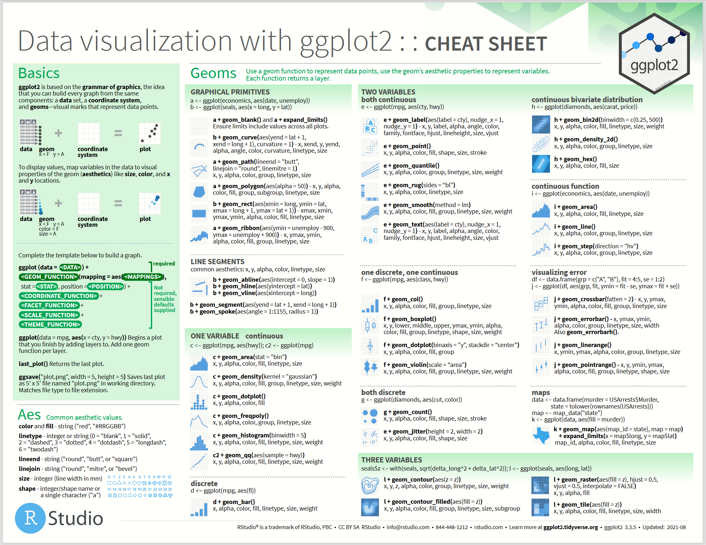
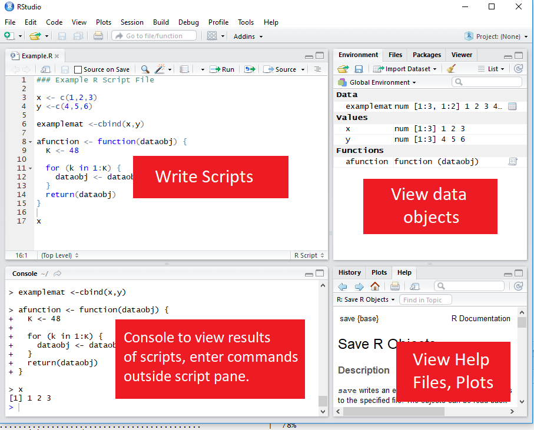

<br>

**This document was generated with R markdown.**


# R & Statistical Programming


Unlike spreadsheet applications (like Excel) or point-and-click statistical analysis software (like SPSS), statistical programming software is based around script files where users write a series of commands to be performed.

R was designed as one of those. By statistical programming, we mean that R is a programming language designed for doing statistics. It has a vocabulary and a grammar that is human readable and needs to be interpreted by your computer through the R software. In this course, we will learn the basics of the R language.


## Advantages of statistical programming software

Statistical programming software have multiple serious advantages over any point-and-click solution:

* Data analysis process is **reproducible** and **transparent**. In Excel, it is impossible to know what a user has done to come to a specific output. In R, all the commands are stored in the scripts, that can be shared and re-run.

* Due to the open-ended nature of language-based programming, there is far more versatility and customizability in what you can do with data.

* *Typically* statistical programming software has a much more comprehensive range of built-in analysis functions than spreadsheets etc., but it is also easy to create your owns.


## Characteristics of R

* R is an open-source language specifically designed for statistical computing (and it is the most popular choice among statisticians).

* Because of its popularity and open-source nature, the R community's package development means it has the most pre-written functionality of any data analysis software. Currently, the CRAN repository contains more than 19000 packages: it is unlikely that you cannot find a function to perform an analysis you would wish.


## Comparison to other statistical programming software

**Stata:** The traditional choice of (academic) economists. Stata is more specifically econometrics focused and is much more command-oriented. Stata is also very different than R in that you can only ever work with one dataset at a time. This means that Stata is unsuited for complex data design, including multiple dataset to combine, for example.

* R is much better than Stata in many regards:
  + While you can use thousands of pre-written functions, R is equally adept at programming solutions for yourself easily.
  + Stata has multiple technical limitations (number of data frames you can load as the same time; amount of available memory; system on which it runs). None of them exists in R.
  + Stata has never been thought as a programming language: the do editor is ugly and inconvenient, and the code is complicated to write for any operations out of the ordinary. R is a programming language, and modern solution, like RStudio, contains all the tools to use it effectively as such.
  + The range of format and data files that operates with R is almost infinite, while it is very limited with Stata (you can read Stata data files with R, but you cannot read R data files with Stata)
  + All you can do with Stata, you can do with R; the revert is untrue. In fact, you can run Stata code within R, if needed (we will see how later during this course).


**SAS:** Similar to Stata, but more commonly used in business & the private sector, in part because it is typically more convenient than Stata for massive dataset. While you can see it used in the books from the nineties, I do not know of anyone who use SAS nowadays.

**Matlab:** Popular in macroeconomics and theory work, not so much in empirical work. Matlab is powerful, but is much more based on programming "from scratch" using matrices and mathematical expressions. 

**Python:** Another option based more on programming from scratch and with less pre-written commands.  Python is not specific to math \& statistics, but instead is a general programming language used across a range of fields. In the recent years, many libraries have been developed to compete with R on the statistical software side, and they have done a good job. However, Python has never been thought as a language for statistical computing, and it feels therefore less natural when used for this purpose. 


The three first solution above are proprietary software, not open-source. This means that if they decide to stop supporting a previous command or format, it will be difficult for you to run your own scripts in the future. They can also prevent you from using the full power of your machine, and they are typically not available on a wide range of platform. _R_ and _Python_ are both open-source, free, and community driven. It is also possible to run them on a very wide range of platforms, including on tablets and phones, with cloud solutions.


## Useful resources for learning R

Internet is full of resources about R. R is so massively used that anything you want to do with R has likely been described and addressed somewhere on the internet.

* **StackOverflow:** https://stackoverflow.com/questions/tagged/r
  + Part of the Stack Exchange network, StackOverflow is a Q&A community website for people who work in programming. Tons of incredibly good R users and developers interact on StackOverflow daily, so it is a great place to search for answers to your questions. The website is also very well designed: if you state a specific problem, you will likely find there an example code with a ready-made solution.
  
* **RStudio Cheat Sheets:** https://www.rstudio.com/resources/cheatsheets/
  + Very helpful 1-2 page overviews of common tasks and packages in R. The cheat sheets contain helps only for the packages and resources developed in the ecosystems of RStudio^[RStudio and R are two different things. R is a programming language for statistical computing developed in the beginning of the nineties, and updated until today. RStudio is an Integrated Development Environment developed by RStudio PBC around 2010 by Hadley Wickham and his team. At the same time, they developed multiple convenient packages, and wrote books to make R convenient and accessible. It is after the work of Hadley Wickham that R became what it is today.].





* **DataCamp:** https://www.datacamp.com/courses/free-introduction-to-r
  + DataCamp  contains interactive online lessons in R.
  + Some of the courses are free (particularly community-written lessons like the one you'll do today), but for paid courses, DataCamp costs about 300 SEK / month.

* **Quick-R:** https://www.statmethods.net/
  + A website with short example-driven overviews of R functionality.

* **R-Bloggers:** https://www.r-bloggers.com/
  + A blog aggregator for posts about R. R-Bloggers is great place to learn really cool things you can do in R.


### Books that are worth reading

Once you will have finished this course, you will not yet know everything you want to know about R: creating your own packages, designing interactive documents, and many other things. Bellow are some _very_ usefull books to help you in your endeavor. All of them are freely available online.

* Wickham, H., & Grolemund, G. (2016). _R for data science: import, tidy, transform, 
visualize, and model data._ O'Reilly Media, Inc. https://r4ds.had.co.nz/
  + This book is really an introduction to R. It teaches you the basics of the workflow in R, data import, cleaning, types, visualization, and elementary modeling. Pretty much what we do in this class.

* Wickham, H. (2016). _ggplot2: elegant graphics for data analysis._ springer.
https://ggplot2-book.org/
  + This book is a must read if you ever want to plot your data. It tells you all you need to know about _ggplot2_, the package to generate beautiful plots with R.

* Wickham, H. (2019). _Advanced R._ CRC press. https://adv-r.hadley.nz
  + _Advanced R_ is what comes after _R for Data Science._ It teached you about functions, objects, performance, combining R with other programming language, such as C++... This book really teaches you R as a programming language.
  
* Wickham, H. (2015). _R packages: organize, test, document, and share your code._ O'Reilly Media, Inc. https://r-pkgs.org/
  + This book will teach you how to write an R package and how to share it with other.
  
* Xie, Y., Allaire, J. J., & Grolemund, G. (2018). _R markdown: The definitive guide._ Chapman and Hall/CRC. https://bookdown.org/yihui/rmarkdown/
  + This book will teach you everything about the R markdown language: an extension of R that allows you to write books including R code and R outputs (the coursebook you are reading now has been written in Rmarkdown).


# Getting Started in RStudio

## RStudio GUI

RStudio is an is an integrated development environment (IDE). This means that in addition to a script editor, it also lets you view your environments, data objects, plots, help files, etc directly within the application.

There are four parts in the RStudio screen. They can be rearranged as it pleases you through **Tools** > **Global options** > **Pane layout**.





1. The **script** pane is a text editor. This is where you read and write the script files: those could be `.R` files, containing R code (equivalent of `.do` files in Stata), `.Rmd` files to write documents (equivalent of jupyter notebook files in Python), or files from other languages than are interoperable with RStudio: C++, python, stata, and many others...

2. The **console** pane show the R interpreter: there you can run code that you do not want to save in a script, or see the outputs of the scripts and code you ran. 

3. The two other panes contain multiple tabs that can be rearranged as you like:

    - The **environment** tab lists all the objects that are loaded in your environment^[The environment contains the objects that are ready to use for your statistical purposes. As you are writing you scripts, and running your model, you may accumulate a lot of objects in your environment, some of which may have taken hours to run. In the global options, you can set to automatically save your environment on close in an `.RData` file, and load it back where your stopped when reopening your project. If you want to empty your environment from previous objects, you can click on the small wiper in your environment tab, called _Clear objects from the workspace_. Saving or cleaning your environment has **no effect** on your data files.]: vectors, functions, dataframes, etc. (we will introduce them later in this module). This is a big difference with Stata: in R, you can load as many objects and data frames as you want in your environment at the same time (Stata is limited to one dataframe per session). For R, the only limit is the memory of your machine.
  
    - The  **Files** tab is a file explorer of your working directory, convenient to find and open the script files that you want to read in the script pane.
  
    - The **Help** tab shows the content of the help file for any function that you are seeking help for.
  
    - The **Plot** tab shows all the plot you made since the opening of the session.
  
    - The **History** tab shows all the code you ran, either through the scripts or directly in the console. This information is also saved in the .history file, in your working directory, unless you chose otherwise in the options.
    
    - The **Viewer** tab shows visual outputs other than plots, such as html tables, or interactive graphs. We will use it when learning about dynamic documents.
    
    - Finally, the **Packages** pane lists the packages (called _libraries_ in other languages) installed and loaded in the environment.
    

## RStudio projects

### Why you shouldn't set working directory manually?

The working directory is the directory from which R should read the scripts and data. You can set the working directory, use the function `setwd()`^[**Note:** make sure that the slashes in the path are forward slashes (/). For Windows, this is not the case if you copy the path from File Explorer so you'll need to change them.]. This is equivalent to the `cd` command in Stata. The argument for the function is simply the path to the working directory, in quotes.

```{r wd, eval=FALSE}
# Set Working Directory
setwd("C:/Users/Mickaël/Documents/MyProject")

```

If you are unsure of where is your working directory, you can use the command `getwd()` (no argument) to get the information.


Although this is a common practice from users who come from a Stata background, this is not a good practice because setting the working directory using the `setwd()` command makes your code harder to share and reproduce: if you move your working directory in your computer, you will have to change your working directory path in your script. Similarly, if you share your scripts with other, they will first have to change the working directory argument before being able to run your script, or they will run into errors.

To avoid these problems, RStudio includes something much more powerful, called **Projects**. RStudio projects are an easy way _to work into multiple contexts, each with their own working directory, history, or source documents_. All the paths to data and source files are relative within the R projects. This means that if you share your project with someone (not only the script), they will not have to change anything in the code to be able to run it. In general, you should always work within Projects in RStudio.

### Instead, use projects

1. To create a new project, click on **File > New Project...**

2. If you are starting a new project from scratch, you may choose to create it in a **new directory**: this directory will likely contain your data, your scripts, and maybe even your output files.

3. RStudio allows you creating many different types of project. If you wish to simply analyze or model some data, you may choose **New Project** again.

4. Then, choose a name and a location for your project. That's it! Remark that the location you choose for your project does not matter: if you decide to move the directory somewhere else later, it will not change anything for your project, because all paths (to data and scripts) should be relative from within the project directory.


Finally, to open a project (containing data, scripts, or anything else), you can either choose **File > Open project** in RStudio, or open the `.Rproj` file created in your project directory, from your file explorer.


**Warning!** Do NOT open scripts within a project from your file explorer, always open the `.Rproj` file. Otherwise, it is as if you were not using the project infrastructure.


## Executing code from the script

* To execute a section of code, highlight the code and click "Run" or use **CTRL+ENTER**.

* For a single line of code, you do not need to highlight, just click into that line.

* To execute the whole document, the hotkey is **CTRL+SHIFT+ENTER**.


## Help files in R

You can access the help file for any given function using the **help function.** You can call it a few different ways:

1. In the console, use `help()`

2. In the console, use `?` immediately followed by the name of the function (no space in-between)

3. In the Help pane, search for the function in question.

`?` is shorter, so that's the most frequent method.

```{r help, eval=FALSE}
# Help on the lm (linear regression) function
?lm
```


# Style advise

## Write lines of 80 characters maximum!

Unlike Stata, with R you do not need any special code to write multiline code - it is already the default (functions are written with parentheses, so its clear when the line actually ends). So there is no excuse for really long lines. Accepted style suggests using a 80-character limit for your lines.

RStudio has the option to show a guideline for margins. **Use it!**
  
1. Go to **Tools -> Global Options -> Code -> Display**
2. Select **Show Margin** and enter 80 characters.

You can also write multiple expressions on the same line by using <span style="color:blue">`;`</span> as a manual line break, but this is a bad practice. You should not do that.


## Give air to your code!

It may seem useless when you start, but having a properly designed code increase readability, and reduce the risk of mistake. Do not hesitate to break lines and to space instructions.

* **GOOD practice:**

```{r eval=FALSE}
tmp <- c(2, 5, 3, 7, 8, 10, 1, 156)

tmp <- tmp * 2

summary(tmp)
```

* **BAD practice:**

```{r eval=FALSE}
tmp<-c(2,5,3,7,8,10,1,156)
tmp<-tmp*2;summary(tmp)
```

Technically, both chunks are equally readable by the R interpreter, but when you will have thousands of lines of codes (it comes faster as you may think...), one style will give you headaches, not the other ones.


## Use comments to explain what you are doing in your code

To further improve the readability of your code, use comments everywhere. A comment is a text that will NOT be interpreted by the R interpreter. This allows you to write anything you like in your code. To create a comment in R, use a hash (`#`). For example:

```{r}
# Here I add 2 + 2
2 + 2
```

You can comment or uncomment lines by highlighting them and pressing CTRL+SHIFT+C.


## Naming conventions

R does not have any constraints for naming objects (_e.g._ variables). However, if you want your dataset to be compatible with other software, such as Stata, you may want to following more restrictice naming convention. To make sure that your variable names could be read in most statistical software, you should follow the following convention:

1. only use lowercase

2. use only letters, integers, and `_` in your variable names (avoid spaces, dots, hyphens, comas, or any special characters)

3. avoid starting a variable name with an integer (you can however use integers later in the name)

4. prefer short names as much as possible


Again, this does not matter for R, but you may run into errors when interacting with other software if you do not follow those simple rules.


# Data types

**Everything** in R is an object. Whatever you do in R, you manipulate objects. The objects may be of different types. There are 5 basic types in R^[There is in fact a sixth type, the **raw** data type, but its use is beyond the scope of this course.]. The other types are a composite combination of those.

1. **logical:** Data that should be interpreted as a logical statement, _i.e._ `TRUE` or `FALSE`.

2. **integer:** `4L`. The `L` tells R to store the 4 as an integer.

3. **numeric:**  `15.5`. Data should be interpreted as a floating number. Integers can be stored as numeric, but numeric may not be integers.

4. **complex:** `2+3i`. These are complex number with real and imaginary part.

5. **character:** `"string or text"`. This is a string of character. 15.5 could be stored in an object of class _character_. In that case, it would not be treated as a number, but as a string of characters. 


The five types above are the bricks to build any other data types. For example, R is known to have a **factor** type, that is used for categorical variables. From an object perspective, a factor is a specific object, but from the R interpreter perspective, the factor type is in fact an integer where each integer is assigned a string of character. Another type, **Date**, is in fact, from the R interpreter perspective, an integer counting the number of days that occurred since the first of January 1970. This is important to understand how data are stored and manipulated by the R interpreter to be able to use and transform them efficiently.


## Defining an object

To define an object, use the arrow `<-`. For example `x <- 2 + 2` will assign 4 as the value of x.

**Note:** In R, there is no distinction between defining and redefining an object (_à la_ gen/replace in Stata).

```{r}
# Define y
y <- 4

# Redefine y
y <- y^2

# Print y
y
```

## Discovering the type of an object

* To discover the "type" of an object, from an object oriented perspective, you can use the function `class(object)`.

* To discover the "type" of the object, from R's point of view, you can use the function `typeof(object)`.

```{r eval=FALSE}
a <- 2L
class(a)
typeof(a)

b <- TRUE
class(b)
typeof(b)

c <- "True"
class(c)
typeof(c)

d <- factor("True")  
class(d)
typeof(d)

```

**Question:** Can you guess what will be the type of `d`?


**Note:** In the example above, `class()` and `typeof()` return the same information for `a`, `b`, and `c` because they are basic R types. For d, because `factor` is a composite type, the object is seen as a factor, but R deals with it as an integer. It is then possible to extract the list of levels with `levels(object)`.

```{r}
d <- factor("True")  
levels(d)

```

R is able to convert some types of objects to others on-the-fly. For example:

```{r}
a <- 2L # a is an integer

b <- 4.4 # b is a numeric

a <- a + b # a is now a numeric
```

If it is not possible for R to convert the object to the desired type during an operation, you will get an error.


## Changing the type of an object

Sometimes, you need to redefine the type of an object yourself, for example, you want to coerce `a <- "2"` into an integer. Common commands can help you with this when the data is formatted suitably:

* `as.integer()` will take data that *looks like integers* but are formatted as another type and change it to `integer`.

* `as.numeric()` does the same, but change it to `numeric` type.

* `as.character()` coerce an object into an object of type `character`.

* other `as.something()` functions exist. You will discover them as you progress with R.


## Assessing the type of an object

In some logical operation, you may need to check if an object is of the desired type. You can perform this with the command `is.integer()`, `is.logical()`, `is.character()`, etc. This function will return a logical value (`TRUE` or `FALSE`) depending on the type of the object.

```{r eval=FALSE}
a <- 2L # a is an integer
is.integer(a)

b <- factor("R")
is.integer(b)
```

**Question:** In the example above, what will be the outcome of `is.integer(b)`?


## Mathematical operations on R objects

As we have seen already with the examples above, it is possible to apply mathematical operation on R objects defined above. These include additions, subtractions, multiplication and division, exponentiation, logarithms, or any other mathematical function that has a definition in R.

```{r}
# Addition and Subtraction
2 + 2


# Multiplication and Division
2 * 2 + 2 / 2


# Exponentiation and Logarithms
2^2 + log(2)
```


## Logical operations on R objects

You can also evaluate logical expressions in R:

```{r}
# Less than
5 < 6


# Greater than or equals to
5 >= 6


# Equals
5 == 6


# Not equals
5 != 6


# Another negation
!TRUE == FALSE
```

You can also use `AND` (`&`) and `OR` (`|`) operation with logical expressions:

```{r}
# Is 5 equal to 5 OR 5 is equal to 6?
(5 == 5) | (5 == 6)


# Is 5 equal to 5 AND 5 is equal to 6?
(5 == 5) & (5 == 6)
```


# Data structures

In Stata, data is stored into one dataset, saved as a dta file. In R, you have many other possibilities. The standard structures in R (they can all coexist in the same environment) are: **vectors**, **matrices**, and **dataframes**. Other composite structures exist, such as tibbles, but we will focus for now on the four basic ones.

## Vectors

The basic data structure containing multiple elements in R is the **vector**.

* An R vector is much like the typical view of a vector in mathematics, _i.e._ it is basically a 1D array of elements.

* Usually, when we talk about _vectors_, we mean **atomic vectors**, the typical type of vectors in R, that are of a single type.

* Contrary to other languages, like C++, vectors in R are dynamic: they have the ability to resize automatically when you add or delete an element. You can assess the length of a vector with the function `length(vector_name)`.

### Creating vectors

* To create a vector, use the function `c()`.

```{r}
# Create `days` vector
days <- c("Mon", "Tues", "Wed", "Thurs", "Fri")

# Create `temps` vector
temps <- c(13, 18, 17, 20, 21)

# Display `temps` vector
temps
```

* Because atomic vectors are of a single type, if you assign values of different types to a vector, it will coerce them to the most general type.

```{r eval=FALSE}
# Create a vector with values of different types
vector_lambda <- c("Mon", TRUE, 2L)
```

**Question:** What will be the type of `vector_lambda`?


### Naming vectors

You can name the element of a vector by assigning a vector of names to your vector.

```{r}
# Create a vector
vec_a <- c("a", "b", "c", "d")

# Naming elements in vec_a
names(vec_a) <- c("1st element", "2nd element",
                  "3rd element", "4th element")

# Display `vec_a` vector
vec_a
```

### Extracting a specific element of a vector

If you would like to extract a specific element of a vector into another object, you simply need to write the position of this element into brackets `[ ]`.

```{r}
# extract the third element of vec_a into vec_b
vec_b <- vec_a[3]

# display vec_b
vec_b
```

If the vector is named, it is possible to call the element by its name, with quotation marks.

```{r}
# extract the third element of vec_a into vec_b
vec_b <- vec_a["3rd element"]

# display vec_b
vec_b
```

### Subsetting vectors

Subsetting is about extracting specific elements of an object. There are multiple ways of subsetting data in R. One of the easiest methods for vectors is to put the subset condition in the brackets:

```{r}
vec_c <- c(2, 5, 8, 18, 65, 1, 23, 45)

vec_c[vec_c >= 18]
```

**Note:** The position of the elements in the vector after subsetting has changed, because some elements have been removed (in the example, 1 is under 18, so it is removed).


In addition to the logical operations we mention earlier, vectors can be subsetted with the operator `%in%`. It is very convenient to identify elements of a vector belonging to a specific ensemble.

```{r eval=FALSE}
vec_c <- c(2, 5, 8, 18, 65, 1, 23, 45)

vec_subensemble <- c(2, 8, 32)

vec_c[vec_c %in% vec_subensemble]
```

**Question:** What will be the output of the command above?


### Changing and assessing the type of a vector

Because _atomic_ vectors are of a single type, it is possible to use the commands `as.integer()`, `as.character()`, etc., to change the type of all the vector element. If it is not possible to coerce an element of the vector to the new type, it will be replaced by a missing value, `NA`.

```{r eval=FALSE}
vec_d <- c("2", "5", "six", "18")
```

**Question:** What would be the output of `as.integer(vec_d)`?


#### The case of factors

* `as.factor()` will reformat a vector into a factor object. Each unique element of the vector will be used as a level of the factor, in alphabetical order.

* Because the alphabetical order may not be the best suitable for you, you may want to define the factor levels yourself, with the `factor()` function. This is useful for ordinal variables, such as Likert scales.

```{r eval=FALSE}
vec_e <- c("very low", "low", "low", "very high", "high", "medium")

test_1 <- as.factor(vec_e)
levels(test_1)


test_2 <- factor(vec_e,
                 levels  = c("very low", "low",
                             "medium", 
                             "high", "very high"),
                 ordered = TRUE)
levels(test_2)
```

**Question:** What is the difference between `test_1` and `test_2`?


### Operations on vectors

Operations on vectors are element-wise. So if 2 vectors are added together, each element of the $2^{nd}$ vector would be added to the corresponding element from the $1^{st}$ vector. Operations can be performed on vectors of different length if the length of one is a multiplier of the length of the other

```{r eval=FALSE}
vec_f <- c(8, 10, 10, 15, 16)
vec_g <- c(18, 3, 1, 10, 5)
vec_h <- c(18, 3, 1, 10)

vec_f * 2


vec_f + vec_g


vec_f + vec_h
```

**Question:** What will be the output of the example above?


## Lists

A **list** is a vector that can store elements of different types and of different length. Lists are a common format when you collect nested data from webscraping (for example, the json output of the twitter API is typically a list; we will come back to this later in this course).


### Creating a list

You create a list with the function `list()`.

```{r}
# Some vectors
vec_f <- c(8, 10, 10, 15, 16)
vec_i <- c("en", "ett", "yes, I am a beginner in Swedish")
vec_j <- c(TRUE, TRUE, FALSE, FALSE, FALSE, FALSE, FALSE, TRUE)

# Create a list
list_a <- list(vec_f, vec_i, vec_j)

# Display the list
list_a
```

As for vectors, it is possible to name elements of a list. For example:

```{r}
# Create a list
list_a <- list(vec_f = vec_f,
               vec_i = vec_i,
               vec_j = vec_j)

# Display the list
list_a
```

In the example above, the first element of the list is named *vec_f* and is given the elements of `vec_f` as value. Note that `vec_f` within the list and outside the list are two different, independent objects.


### Extracting elements of a list

With double brackets `[[ ]]`, you can extract elements from a list:

```{r}
# Extract the second element of the list
list_a[[2]]


# Or extract it using its name
list_a[["vec_i"]]
```

You can also extract a specific value from a specific element of a list:

```{r eval=FALSE}
# Extract the third value of the second element of the list
list_a[[2]][3]
```

* The position of the list element is stated first, with double brackets, the position of the value to extract within the list element is stated second, with single brackets, because the list simply contains a series of atomic vectors (this also means that elements of the list can be stored as atomic vectors^[In fact, it is possible to store more complex objects than atomic vectors as element of a list, but that would be undoubtedly going a bit too far.]).

* If the value to extract does not exist, `NA` is returned.


## Matrices

* Data in a 2-dimensional structure can be represented in two formats, as a `matrix` or as a `dataframe`.

* A matrix is used for 2D data structures of a single data type (like atomic vectors). Usually, matrices are composed of numeric objects.

* To create a matrix, use the `matrix()` command. The syntax of `matrix()` is:

```{r, eval=FALSE}
matrix(x,
       nrow  = a,
       ncol  = b,
       byrow = FALSE/TRUE)
```

* `x` is the data that will populate the matrix.

* `nrow` and `ncol` specify the number of rows and columns, respectively. Generally need to specify just 1 since the number of elements and a single condition will determine the other.

* `byrow` specifies whether to fill in the elements by row or column. The default is `byrow = FALSE`, _i.e._ the data is filled in by column.


### Creating a matrix from scratch

A simple example of creating a matrix would be:

```{r}
vec_k <- c(18, 21, 31,
           10,  8,  6)

matrix(vec_k,
       nrow  = 2,
       ncol  = 3,
       byrow = FALSE)
```

Note the difference in appearance if we instead `byrow = TRUE`

```{r}
matrix(vec_k,
       nrow  = 2,
       ncol  = 3,
       byrow = TRUE)
```

* Note that the line breaks and spaces, when defining `vec_k`, are purely for readability purposes. Unlike Stata, R allows you to break code over multiple lines without any extra line break syntax.

* As for vectors and lists, it is possible to name elements of the matrix. Only here, instead of using `names()`, we use `rownames()` and `colnames()`.

```{r}
m <- matrix(vec_k,
            nrow  = 2,
            ncol  = 3,
            byrow = TRUE)

rownames(m) <- c("1st row", "2nd row")

# Diplay m
m
```

### Matrix operations

* In R, matrix multiplication is denoted by `%*%`, as in `A %*% B`

* `A * B` instead performs *element-wise* (Hadamard) multiplication of matrices, so that `A * B` has the entries $a_1 b_1$, $a_2 b_2$ etc.

* An important thing to be aware of with R's `A * B` notation, however, is that if either of the terms is a 2D vector, the terms of this vector will be distributed element-wise to each column of the matrix.

```{r}
# Create a vector
vec_l <- c(1, 2)

# Display vec_l
vec_l


# Element-wise operations with a vec_l and m, defined above
vec_l * m
```

## Dataframes

Dataframes are probably the most common structure you will use in R. Dataframes are generic object in R to store tabular data. They are composed with a series of vectors of *same length* and possible *different type* (to the contrary of matrices that have only one type).

* Each vector is stored as a column of the dataframe.

* Each column as a name. If no names are given to a column when it is set, R will provide a default name (usually `V1` or `X1`).

* Usually, when you import data in R from a data file (such as a `.dta` Stata file, or a `.csv` file), the content will be stored in a dataframe. You can also create dataframes from vectors or from matrices, manually.

### Creating a data frame

* Creating a dataframe might be as simple as converting a matrix into a dataframe:

```{r}
df <- as.data.frame(m)

df
```

* Another way of creating a data frame is to combine other vectors or matrices (of the same length) together.

```{r}
vec_m <- c("a", "b")

df <- data.frame(vec_m, m)

df
```

* Note that your dataframe, `df`, now appears in your environment tab. At the end of the line, you see a small table. If you click on it, you will view the content of the dataframe.

* You can rename the columns of the dataframe with the `names()` function, as before.


### Adding a new column to a data frame

Now, in the example above, when we merge vec_m with the matrix m to create our dataframe, we assumed that the observations in the vector and in the matrix were following the same order. Imagine that you want to append a vector to a dataframe that is following a different order (elements of the new vector appear in a different order as the elements in our dataframe). It is still possible to merge them if you have a key by which you can match the rows.

Here is an example. Let's first create the following dataframe:

```{r}
# 
df_2 <- data.frame(id = c("b", "a", "c"),
                   value = c(15, 32, 81))
```

Let's assume that `id`, in `df_2`, and `vec_m`, in `df`, contains the same information: a unique identifier of each observation. You will note that `df_2` contains one more observations (`id = "c"`), and the order of observations differs from the ones in `df`. To merge nonetheless `df` with `df_2`, you can use the following function:

```{r}
df_3 <- merge(x = df, y = df_2,
              by.x = "vec_m",
              by.y = "id",
              all.x = TRUE, all.y = TRUE)

```

* In the `merge()` function, the x and y indicate the names of the dataframe to combine.

* `by.x` and `by.y`, respectively indicate the names of the column to use to match observations between `x` and `y`.

* `all.x` and `all.y` indicate what to do with observations that do not appear in both `x` and `y` (here, `"c"` only appears in `df_2`).
  + If both are set to `TRUE`, all observations will be kept in the output dataframe, and missing columns will be filled with `NA`.
  + If one is set to `FALSE`, only the observations that also appear in the other dataframe will be kept.


### Adding rows to a data frame

Let's assume that we would like to append the following dataframe to df_3:

```{r}
df_4 <- data.frame(vec_m = c("e", "f"),
                   X1 = c(81, 32),
                   X2 = c(156, 32),
                   X3 = c(321, 51),
                   value = c(4, 127))
```

You can append the two new rows with the following function^[Note that when you use the `rbind` function, all columns must be present in both dataframe. If you would like to append rows from a dataframe with missing columns, you can use the command `rbind.fill` from the `plyr` package. We will see during the next module how to install and use packages.]:

```{r}
df_3 <- rbind(df_3, df_4)
```

**Note** that the order of the columns do not matter with `rbind`, as long as they are all present.


### Selections in a dataframe

Once you have a dataframe, you will usually want to create or manipulate particular columns of it. The columns are usually variables. 

* The default way of invoking a named column in R is by appending a dollar sign and the column name to the data object. `df$vec_m` would return the variable named `vec_m` in the dataframe.

* Another way is to name the column of interest into brackets, as for vectors, lists, or matrices `df[, "vec_m"]`
  + **Note** the comma `,` before the variable name. This is because the dataframe is two-dimensional: rows are accessed first, then columns (yes, this is the contrary as for list, and yes, it is unpleasant). As such, if you want to extract the second elements of `vec_m`, you would write: `df[2, "vec_m"]`.
  + Another way to extract the second element of `vec_m`: `df$vec_m[2]`.
  
* You can also select a subset of columns or rows that meet a given condition


### Subsetting a data frame

```{r}
# Subsetting observations when X3 >= 35 AND X2 > 20
df_5 <- df_3[(df_3$X3 >= 35) & (df_3$X2 > 20),]
df_5
```

**Note** that the column argument is left empty, so all columns are returned by default. You could as well indicate a vector of columns to keep in the output.

```{r}
# Selecting specific columns while subsetting
df_5 <- df_3[(df_3$X3 >= 35) & (df_3$X2 > 20), c("vec_m", "X2", "X3")]
df_5
```

Now, you note that a line with missing values was added in the operation because `df_3` contains a row with missing information. You can subset incomplete observations with the following command:

```{r}
# Excluding lines with missing values
df_5 <- df_5[complete.cases(df_5), ]
```

# To do before the next class

That's it for the first module. In the next module, we will start using real data. We will learn how to use packages, how to import data from Stata, Excel, or other sources into R, and we will learn plenty of other useful practices for data cleaning and manipulation.


**Before the next module:**

1. Set up your global setting as you see fit, explore the options

2. Go through this material again and try other cases: run all the codes for yourself, change the values, change the parameters, see what happens

3. Work through the Intro to Base R course on DataCamp^[You will learn the basic functionalities that the core R environment provides. This foundation is necessary for future assignments where you will apply more advanced functions and methods. This assignment will not be graded, but I strongly encourage you to complete all exercises before the start of the next session.]:
https://www.datacamp.com/courses/6356 


Next time, we will move on, and consider the knowledge provided here is mastered.


