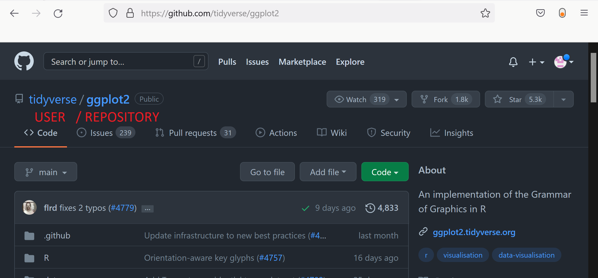

<br>

**This document was generated with R markdown.**


```{r setup, include=FALSE}
# library(tidyverse)
# library(fueleconomy)
# library(rio)
```

# Packages in R

Packages in R are kinds of extensions. They can bring new functions or new data to the base R software, similar to user-written commands (think `ssc install`) in Stata, libraries in Python (think `pip install`), or plugins in Excel. Yet, with Stata or Excel, **most** of the things you do probably use the core Stata commands. In R, most of your analyses will probably be done using packages. Once loaded in the environment, a package behave exactly as a core component of R.


There are two main sources of packages in R:

1. The most important is the [CRAN repository](https://cran.r-project.org/web/packages/available_packages_by_name.html). This is the official source of package containing a very extensive list (more than 19'000) with their documentation. To be available on CRAN, packages need to fulfill some quality criteria, checked by a team of volunteers. It does not guarantee complete security, but at least the packages have been reviewed by someone before being available in the repository^[The CRAN also provides the list of authors for each packages they publish: you can assess if the author is a famous unknown, or someone from a serious institution.]. 

2. You can also to install packages directly from [github](https://github.com/). While github may contain more recent versions of the packages, as well as some that are not available in the official repository, those are **NOT reviewed by anyone**. There is therefore no guarantee at all that the package respects minimum quality criteria, or even that the package works. It might however be useful to use in some cases.


## Installing packages from the official repository (CRAN)

* To install a package from RStudio, you can click on **Tools** > **Install packages...**, type the name of the package you would like to install, and click **Install**.

* Alternatively, you can use the function (preferably in the console) [`install.packages()`](https://www.rdocumentation.org/packages/utils/versions/3.6.2/topics/install.packages)

* To begin with, let's install two packages:

  + [`tidyverse`](https://www.tidyverse.org/), developed by Hadley Wickham: "The tidyverse is an opinionated collection of R packages designed for data science. All packages share an underlying design philosophy, grammar, and data structures"^[Source: https://www.tidyverse.org/].
  
  + [`remotes`](https://cran.r-project.org/web/packages/devtools/index.html), developed by Gábor Csárdi et al.: `remotes` allows your to download and install packages from other sources than the official repository, including github.
    
  + [`rio`](https://cran.r-project.org/web/packages/rio/vignettes/rio.html), developed by Jason Becker et al.: `rio` is a package for easy data import, export (saving), and conversion.

```{r, eval=FALSE}
install.packages("tidyverse")
install.packages("remotes")
install.packages("rio")
```    


## Installing packages from Github

To install package from [github](https://github.com/), you can use the following command:

```{r, eval=FALSE}
remotes::install_github("user/repository")
``` 

where `user` is the name of the user on github who posted the package, and `repository` is the name of the package on github.




## Using functions from a package in your scripts

* The best way to call a function from a package is through the following code: `package_name::function_name()`. With this, each function call is precisely related to the package it is from. This is what we used in the example above to install a package from github.

* In some cases, especially when you are using a specific package a lot in your script, it can be handy to load the package once for all. To do this, use the [`library(package_name)`](https://www.rdocumentation.org/packages/base/versions/3.6.2/topics/library) function at the beginning of your script. If you would like to load all the functions of the tidyverse in your environment, use:

```{r, eval=FALSE}
library(tidyverse)
``` 


# Importing, exporting, selecting

## Importing using `rio`

Previously, importing and exporting data in R was a mess, with a lot of different functions for different file formats. Stata `.dta` files alone required two functions: `read.dta` (for Stata 6-12), `read.dta13` (for Stata 13 and later), etc.

The [`rio`](https://cran.r-project.org/web/packages/rio/vignettes/rio.html) package simplifies this by reducing all of this to just one function, [`import()`](https://www.rdocumentation.org/packages/rio/versions/0.5.5/topics/import), that automatically determines the file format of the file and uses the appropriate function from other packages to load in a file. It is able to load more than 30 different datafile formats, including, csv, Excel, SAS, SPSS, Stata, Matlab, JSON, and others. If a file is not recognize by `rio`, it is always possible to find and use a specific function for this unrecognized file format.

Let's try. On canvas, I provide you with a zipfile named `7316 - Module 2 - data.zip`. You can download the file, unzip it, and place the data files it contains in a `data` folder^[In practice, you may name the `data` folder as you like, but it is common practice to name it `data`.] in your project directory^[**Do not forget** from Module 1: before starting any new data work, create a new R project in a new directory. The directory will contain your data, scripts, and outputs.].

Now, your `data` folder contains the School questionnaire data file from the PISA survey (2018) that I downloaded from the [OECD website](https://www.oecd.org/pisa/data/2018database/). I provide them in two different format, for the example:

* `cy07_msu_sch_qqq.sas7bdat`: the dataset as an SAS data file.

* `CY07_MSU_SCH_QQQ.sav`: the dataset as an SPSS data file.


Use the following command to load the data in your R environment:

```{r}
# Dataset in SAS format
pisa_sas <- rio::import("data/cy07_msu_sch_qqq.sas7bdat")

# Dataset in SPSS format
pisa_spss <- rio::import("data/CY07_MSU_SCH_QQQ.sav")

``` 

**Note:** If a dataset you are interested in is part of a package, you can load it by simply calling its name. For example, let's use the `Wages1` dataset stored in the package `Ecdat`.

```{r}
wages <- Ecdat::Wages1
```

## Display the structure of the dataset

After loading your dataset, you may want to see its structure. You can see the structure in the environment tab, by clicking on the small arrow before the `dataframe` name. Alternatively, you can use the function `str()`. It will display the names of the variables within your `dataframe`, their `types`, and a few first observations.

```{r, eval=FALSE}
str(pisa_sas)

``` 

## Exporting data

If you want to save an object, _e.g._ pisa_sas, into a new file, you can use:

```{r}
# SOLUTION 1:
saveRDS(pisa_sas, "data/pisa_sas.Rds")

# SOLUTION 2:
rio::export(pisa_sas, "data/pisa_sas.Rds")

``` 

The function `saveRDS()` is the base function to save R data object into a file. `rio::export()` is the wrapper from the `rio` package. They both lead to the exact same result.

`Rds` is the standard format to save data in R. I advise you to use it, because you are sure that the data are saved exactly as you see them in R (no loss of information). However, if you need to export the data into a file compatible with another statistical software, you can also use `rio::export()` to export the data into whatever format you wish.

**Warning:** Some format will result in a loss of data, in case some types or encoding of your dataframe are not compatible with the chosen file format.

```{r, eval=FALSE}
# Saving the data into an Excel sheet
rio::export(pisa_sas, "data/pisa_sas.xlsx")

# Saving the data for Stata
rio::export(pisa_sas, "data/pisa_sas.dta")

``` 

# Data and the tidyverse

In the recent years, Hadley Wickham introduced the Tidyverse: a set of functions to manipulate data in R.

### Principles of tidy data

Rules for tidy data (from *R for Data Science*):

1. Each variable must have its own column.
2. Each observation must have its own row.
3. Each value must have its own cell.


A motivating principle behind the creation of the tidyverse was the language of programming should really behave like a language. This means that most of the outputs of the tidyverse could be obtained without it, using only R base functions, with a different syntax. The tidyverse aims at making all the data preparation process more homogeneous: data manipulation in the tidyverse is oriented around a few key "verbs" that perform common types of data manipulation.


## A parenthesis about the tibbles

Last class, we covered `dataframe`, the most basic data object class for data sets with a mix of data class. Today, we introduce one final data object: the `tibble`! The tibble is an alternative to the `dataframe` that has been created as a part of the `tidyverse` package. As `dataframe`, `tibble` contain a table of data, _e.g._ variables as vectors in columns, possibly of different types, and rows as values. In most cases, you would not see the difference of using `dataframe` or `tibble`, but you need to know both, because some functions of the `tidyverse` require the use of `tibble`. Additionally, `tibble` differs from `dataframe` when:

* displaying `dataframe`: it will print as much as much output as allowed by the `max.print` option in the R environment. With large data sets, that is one thousand lines. `tibble` by default print the first 10 rows and as many columns as will fit in the window: more readable.

* matching in `dataframe`: when using the `$` method to reference columns of a data frame, partial names will be matched if the reference isn't exact. This might sound good, but the only real reason for there to be a partial match is a typo, in which case the match might be wrong.

### Creating or converting to tibbles

The syntax for creating tibbles exactly parallels the syntax for data frames:

- [`tibble()`](https://www.rdocumentation.org/packages/tibble) creates a tibble from underlying data or vectors (this is equivalent to `data.frame`).

- [`as_tibble()`](https://www.rdocumentation.org/packages/tibble/versions/1.4.2/topics/as_tibble) coerces an existing data object into a tibble.

```{r, eval=FALSE}
df_tibble <- tibble::as_tibble(pisa_sas)

class(pisa_sas)
class(df_tibble)
``` 

You can display `df` and `df_tibble` to see the difference:

```{r, eval=FALSE}
pisa_sas

df_tibble
``` 

## Another parenthesis about Pipes

Another famous function from the tidyverse is ***pipe***, denoted `%>%`:

* Pipes allow you to combine multiple steps into a single piece of code.

* Specifically, after performing a function in one step, a pipe takes the data generated from the first step and uses it as the data input to a second step. Example:

```{r}
library(dplyr)

tibble::as_tibble(pisa_sas) %>% class()
```

This is absolutely equivalent to writing, but the code bellow does not require an extra package (`dplyr`), to run:

```{r}
class(tibble::as_tibble(pisa_sas))
```

In general, I find that the pipes `%>%` makes the code less intuitive and more prone to errors. It also does not save the intermediary steps. Thus, I don't use it. However, it is often seen in books and example codes in R, so you need to know what it means. You want also use it as you like. 

# Tidy datasets

## Extract variables from dataframe

Now, you can see the two datafiles loaded in dataframes your environment, with 21'903 observations. But the dataset is very big. If you are interested in specific variables, you can extract them into a new `dataframe`. For example, to extract, `"CNT"`, `"CNTSCHID"`, `"SC016Q01TA"`, `"SC155Q02HA"`, from `pisa_sas`:

With the tidyverse, it is possible to do it using [`select()`](https://www.rdocumentation.org/packages/dplyr/versions/0.7.3/topics/select).

```{r}
library(dplyr)

# Using brackets
df <- pisa_sas[, names(pisa_sas) %in% c("CNT",
                                        "CNTSCHID",
                                        "SC016Q01TA",
                                        "SC155Q02HA")]

# Using select
df_selection <- pisa_sas %>% select(CNT, CNTSCHID, SC016Q01TA, SC155Q02HA)

``` 

## Remove dataframe or variables

You created a `dataframe` called `df`, containing the variables you are interested in. You may want to remove the two prior datasets that you loaded, to save memory:

```{r, eval=FALSE}
rm(pisa_spss, pisa_sas)

``` 

The command above removes two complete datasets from your environment. If you want to remove a variable in a dataset, for example, `"CNTSCHID"`, use the following command:

```{r, eval=FALSE}
df[, "CNTSCHID"] <- NULL

``` 

It is possible to do the same with `select()`, from the tidyverse:

```{r}
# Using select
df_drop <- df %>% select(-CNTSCHID)
```

Note the `-` before the variable name to drop.


**Question:** Do you see any way to get the same results using the `names()` function? And with the `$` operator?


## Rename columns

We have already seen in module 1 how to do it.

```{r, eval=FALSE}
# With base R
names(df)[names(df) == "SC155Q02HA"]<- "new_name"

``` 

## Extract a random sample from a dataframe

`df` is very big. If you would like to work on a subset of data, you can extract a random sample from your dataset with the following code:

```{r, eval=FALSE}
df <- df[sample(nrow(df), 5000), ]

``` 

where `5000` is the number of random rows that you want to extract.


## Gather data

If values for a single variable are spread across multiple columns (e.g. income for different years), [gather](https://www.rdocumentation.org/packages/tidyr/versions/0.8.0/topics/gather) moves this into single "values" column with a "key" column to identify what the different columns differentiated. In short, gather converts a wide dataset into long. Example:


```{r}
library(dplyr)

# We create a dataframe for the example
earnings_panel <- data.frame(person = c("Elsa", "Mickey", "Ariel", "Gaston",
                                    "Jasmine", "Peter", "Alice"),
                         y1999 = c(10, 20, 17, 19, 32, 22, 11),
                         y2000 = c(15, 28, 21, 19, 35, 29, 15))

# Gather data
earnings_panel <- earnings_panel %>%
  tidyr::gather(key = "year", value = "wage", y1999:y2000)

```

You could also do this without the tidyverse, but that would require more lines of code.


## Spreading data

Spread tackles the other major problem, that often times (particularly in longitudinal data) many variables are condensed into just a "key" (or indicator) column and a value column. In short, spread converts a long dataset into wide. Example:

```{r, eval=FALSE}
earnings_panel %>% tidyr::spread(key = "year", value = "wage")

```


# Cleaning data

The tidyverse contains many functions to help you cleaning the data. In most cases, they are redundant to base R, but sometimes provide reasonable enhancement to the base R. The main functions are:

1. [`filter()`](https://www.rdocumentation.org/packages/dplyr/versions/0.7.3/topics/filter) subsets the rows of a data frame based on their values.

2. [`mutate()`](https://www.rdocumentation.org/packages/dplyr/versions/0.7.3/topics/mutate) adds new variables that are functions of existing variables. 

3. [`summarize()`](https://www.rdocumentation.org/packages/dplyr/versions/0.7.3/topics/mutate) creates a number of summary statistics out of many values.

4. [`arrange()`](https://www.rdocumentation.org/packages/dplyr/versions/0.7.3/topics/arrange) changes the ordering of the rows.

**Note**: the first argument for each these functions is the data object.


## Filter data

Filtering keeps observations (rows) based on conditions, just like using use subset conditions in the row arguments of a bracketed subset. Example:

```{r, eval=FALSE}
# Using brackets
wages[(wages$school > 10) & (wages$exper > 10),]

library(dplyr)
# Using filter
wages  %>% filter(school > 10, exper > 10)


```

Notice a couple of things about the output:

1. It doesn't look like we told [`filter()`](https://www.rdocumentation.org/packages/dplyr/versions/0.7.3/topics/filter) what data set we would be filtering: that's because the data set has already been supplied by the pipe. We could have also written the filter as:

```{r, eval=FALSE}
filter(wages, school> 10, exper > 10)  
```

2. We didn't need to use the logical `&`. Though multiple conditions can still be written in this way with `filter()`, the default is just to separate them with a comma.


## Mutate data

Creating new variables that are functions of existing variables in a data set can be done with [`mutate()`](https://www.rdocumentation.org/packages/dplyr/versions/0.7.3/topics/mutate).

[mutate()](https://www.rdocumentation.org/packages/dplyr/versions/0.7.3/topics/mutate) takes as its first argument the data set to be used and the equation for the new variable:

```{r}
# With base R:
wages$expsq <- wages$exper^2

# With the tidyverse:
wages <- wages %>% mutate(expsq = exper^2) 
```

## Summarize data

Summary statistics can also be created using the tidyverse function [`summarize()`](https://www.rdocumentation.org/packages/dplyr/versions/0.7.3/topics/mutate) 

The [`summarize`](https://www.rdocumentation.org/packages/dplyr/versions/0.7.3/topics/summarise) functions uses summary statistic functions in R to create a new summary tibble, with syntax largely identical to mutate().

Let's try summarizing with the [mean()](https://www.rdocumentation.org/packages/base/versions/3.4.3/topics/mean) summary statistic.

```{r}
# With the tidyverse:
summary_stat <- wages %>% summarize(avg_wage = mean(wage),
                                    median_wage = median(wage))

# With base R:
summary_stat <- data.frame(avg_wage    = mean(wages$wage),
                           median_wage = median(wages$wage))
```

### Summary Statistics functions in R

There are a number of summary statistics available in R, which can be used either with the [summarize()](https://www.rdocumentation.org/packages/dplyr/versions/0.7.3/topics/summarise) command or outside of it:

* [`mean()`](https://www.rdocumentation.org/packages/base/versions/3.4.3/topics/mean),

* [`median()`](https://www.rdocumentation.org/packages/stats/versions/3.4.3/topics/median),

* [`sd()`](https://www.rdocumentation.org/packages/stats/versions/3.4.3/topics/sd),

* [`cor()`](https://www.rdocumentation.org/packages/stats/versions/3.4.3/topics/cor),

* [`quantile()`](https://www.rdocumentation.org/packages/stats/versions/3.4.3/topics/quantile),

* [`IQR()`](https://www.rdocumentation.org/packages/stats/versions/3.4.3/topics/IQR)


**Warning:** If your data contains missing values, the function will send `NA`. To avoid it, use the `na.rm` argument:

```{r}
# No na.rm
mean(df$SC016Q01TA)

# With na.rm
mean(df$SC016Q01TA, na.rm = TRUE)
```


* [`length()`](https://www.rdocumentation.org/packages/base/versions/3.6.2/topics/length): gives you the length of a vector, equivalent to `dplyr::n()` in the tidyverse.

  + `length(unique())` will then give you the number of unique values in a vector, equivalent to [`n_distinct()`](https://www.rdocumentation.org/packages/dplyr/versions/0.7.3/topics/n_distinct) in the tidyverse.
  
  + You can also extract frequencies of all unique values into a `table()`:
  
```{r}
table(df$CNT)
```

**Question:** How would you extract this table into Excel?

**Solution:**

```{r, eval=FALSE}
tmp <- as.data.frame(table(df$CNT))

rio::export(tmp, "data/CNT.xlsx")
```


## Group data

Creating summary statistics by group is another routine task. This is accommodated in the tidyverse using the [`group_by()`](https://www.rdocumentation.org/packages/dplyr/versions/0.7.3/topics/group_by). In base R, you can use `aggregate()`.

The arguments, in addition to the data set, are simply the grouping variables separated by commas.

For example, let's calculate the mean per gender:

```{r}
# With base R:
aggregate(wage ~ sex, wages, mean)

# With the tidyverse
wages %>% group_by(sex) %>% summarize(avg.wage = mean(wage))
```

About the `aggregate` function, note the `~` to separate `wage` and `sex`. This means by, and is very much used in the formulas of any statistical models, as we will see later in this course.


## Arrange (sort) data

If you want to sort your data by the values of a particular variable, you can do so as well with the [`arrange()`](https://www.rdocumentation.org/packages/dplyr/versions/0.7.3/topics/arrange) function (tidyverse), or with the `sort()` function (base R).

```{r, eval=FALSE}
# With base R, order by increasing experience and decreasing wage
wages[order(wages[, "exper"], -wages[, "wage"]), ]

# Same with the tidyverse
wages %>% arrange(exper, -wage)
```

## Recode variables

Along with renaming variables, recoding variables is another integral part of data wrangling. You can do this with or without the tidyverse. For example, to recode `sex` as a dummy variable


```{r, eval=FALSE}
# With the tidyverse
wages$is_female <- wages$sex %>% recode("male" = 0,
                                        "female" = 1)

# With base R
wages$is_female <- as.integer(wages$sex == "female")
```

## Identify missing values

Does one of your variables contains missing values? You can assess if an observations is missing with the function `is.na()`. Missing values in R are coded `NA`. For example:

```{r}
a <- NA

is.na(a)
``` 
You can apply it to a vector:

```{r }
missing_sc016Q01ta <- is.na(df$SC016Q01TA)

``` 

To know the number of cases are found in a categorical or a logical variable, use `table`. The table commands counts all the occurence of each values of a variables. Example:


```{r}
table(missing_sc016Q01ta)
``` 

### Removing missing values

In the previous lesson, we removed the missing values using:

```{r, eval=FALSE}
df <- df[complete.cases(df), ]
```

The command above remove all the rows containing missing values on any variables of `df`.

**Question:** Using `is.na()`, how could you remove rows containing missing values on `SC016Q01TA`?


**Solution:**

```{r, eval=FALSE}
df_2 <- df[!is.na(df$SC016Q01TA), ]
```

### Recode missing Values

Another problem characteristic of observational data is missing data. In R, the way to represent missing data is with the value `NA`. You can recode missing value that *should be* `NA` but are code using a different schema either by using brackets, or the tidyverse [na_if()](http://dplyr.tidyverse.org/reference/na_if.html) function.

```{r, eval=FALSE}
# Replace 99-denoted missing data with NA

# With base R
wages[wages$school == 99, ] <- NA

# With the tidyverse
wages$school <- wages$school %>% na_if(99)
```

You can check for (correctly-coded) missing-values using the [`is.na()`](https://www.rdocumentation.org/packages/base/versions/3.4.3/topics/NA) function.

```{r}
## Missing 
table(is.na(wages$school))

```

**Note:** R does not naturally support multiple types of missingness like other languages, although it's possible to use the [`sjmisc`](https://cran.r-project.org/web/packages/sjmisc/index.html) package to do this.


# To do before the next class

1. Go through this material again and try other cases: run all the codes for yourself, change the values, change the parameters, see what happens.

2. If you haven't finished during the class, finish the practice assignment of Module 2.


Next time, we will move on, and consider the knowledge provided here is mastered.

