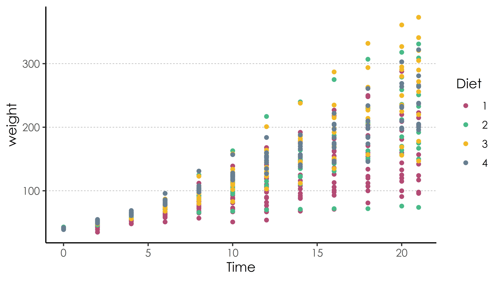

<br>

**This document was generated with R markdown.**

\newpage

Now, you know how to import data, create and clean a dataset, either from files, or from the web. In this module, we will learn how to create visuals from the dataset, including graphs and outputs of regression models.

# Graphs in R

## Data visualization overview

One of the strong points of R is creating very high-quality data visualization. R is very good at both "static" data visualization and interactive data visualization designed for web use. Today, we will cover static data visualization.

## ggplot2 for data visualization

The main package for publication-quality static data visualization in R is [`ggplot2`](https://ggplot2.tidyverse.org/), which is part of the tidyverse collection of packages. With `ggplot2` you control all the elements of your graphs, from the data you visualize and the way you represent it, to the style of the graph and the quality of the output (high-resolution...).



The workhorse function of ggplot2 is [`ggplot()`](https://www.rdocumentation.org/packages/ggplot2/versions/2.2.1/topics/ggplot), response for creating 
a very wide variety of graphs. The `gg` stands for "*grammar of graphics*". In each  `ggplot()` call, the appearance of the graph is determined by specifying:

* the `data`(frame) to be used,

* the `aes`(thetics) of the graph: like size, color, x and y variables,

* the `geom`(etry) of the graph: the chosen representation (_e.g._ `point`, `histogram`, `bar`, `qq`, `curve`, `density`, `abline`, `boxplot`, `map`, etc., etc.)

* You may then add other funtions to your graph, to define, `labs`, `ggtitle`, `ggtheme`, etc.

```{r, eval=FALSE}
library(ggplot2)

mygraph <- ggplot(mydata) + aes(...) + geom(...) + ... 
```


## Scatterplots

First, let's look at a simple scatterplot, which is defined by using the geometry `geom_point()`.

**Note:** `ggplot2` requires many functions to run. I recommend you in this case to load the full library before using it, or you will spend your time writing `ggplot::` everywhere.

```{r}
df <- rio::import("data/graph_reg.Rds")

# Loading the grammar of graphs
library(ggplot2)
```

```{r, fig.width=4, fig.height=2.25, dpi=1200}
# Defining data
ggplot(df) +
  # defining aesthetics
  aes(x = iv, y = dv) + 
  # defining geometry
  geom_point()

```

* Each of the graph elements is an R function.

* Functions in `ggplot2` are added up with a `+` symbol.

* Variables names are not quoted (`""`) in `ggplot2`: they are written directly with their full names (here: `iv`, `dv`)

### Colors and shapes

* Graphs can be extensively customized using additional arguments inside of elements, or with additional functions. For example, you may want to **color the element by group**:

```{r, fig.width=4, fig.height=2.25, dpi=1200}
ggplot(df) + aes(x = iv,
                 y = dv,
                 color = group) + 
  geom_point()

```

* Or you want to combine it with different shapes, in case you print in black and white:

```{r, fig.width=4, fig.height=2.25, dpi=1200}
ggplot(df) + aes(x = iv,
                 y = dv,
                 color = group,
                 shape = group) + 
  geom_point()

```

Now, if you are unhappy with the choice of color or shapes, you can customize them:

```{r, fig.width=4, fig.height=2.25, dpi=1200}
ggplot(df) + aes(x = iv,
                 y = dv,
                 color = group,
                 shape = group) + 
  geom_point() +
  scale_color_manual(values = c("green", "blue")) + 
  scale_shape_manual(values = c(3, 4))

```

* The color can be written as color names in english, `blue`, `green`, `red`, `black`, etc. or as hexadecimal values, _e.g._ `#FF5733`. You can find a color picker here: https://htmlcolorcodes.com/

* The number of shapes are limited to 25 (numbered from 1 to 25). You can test them as you like, or you can find the list here: http://www.sthda.com/english/wiki/ggplot2-point-shapes

* In both cases, you have to make sure that your color or shape list contains as many values as the number of groups you want to plot (or, it can contain more, but not less).


### Adding gradient colors

If you have a continuous scale to color, you may want to add gradient.

```{r, fig.width=4, fig.height=2.25, dpi=1200}
ggplot(df) + aes(x = iv, 
                 y = dv,
                 color = iv) + geom_point() + 
  scale_color_gradient(low = "green", high = "red", 
                       name = "colored IV")

```

## Axis and titles

Sometimes, you would like to use a customize scale for the axis:

```{r, fig.width=4, fig.height=2.25, dpi=1200}
ggplot(df) + aes(x = iv,
                 y = dv,
                 color = group,
                 shape = group) + 
  geom_point() +
  xlim(-4, 4) + ylim(-10,10)

```

* **Note** the warning message you get: this is because some data points are out of bounds, hence, not plotted on the graph.

You can also change the name of axis, for example, using full labels:

```{r, fig.width=4, fig.height=2.25, dpi=1200}
ggplot(df) + aes(x = iv,
                 y = dv,
                 color = group,
                 shape = group) + 
  geom_point() +
  labs(x = "independent variables",
       y = "dependent variables",
       color = "categories",
       shape = "categories")
```

* **Note** that you have to indicate both `color` and `shape` in your graph to change the title of your legend, because you graph include colors and shapes. If you change only one, the legen will be repeated twice: once with the new label you wrote, one with the variable name. Example:

```{r, fig.width=4, fig.height=2.25, dpi=1200}
ggplot(df) + aes(x = iv,
                 y = dv,
                 color = group,
                 shape = group) + 
  geom_point() +
  labs(x = "independent variables",
       y = "dependent variables",
       color = "categories")
```


### Lines

To plot a straight line somewhere on your graph, you can use `geom_vline()` (vertical) or `hline` (horizontal):

```{r, fig.width=4, fig.height=2.25, dpi=1200}
ggplot(df) + aes(x = iv,
                 y = dv) + 
  geom_point() + 
  geom_vline(xintercept = 1.6,
             color = "#FF5733",
             linetype = "dotted") + 
  geom_hline(yintercept = 2.3,
             color = "green",
             linetype = "solid")
```

* Here again, you can customize the position, color, or linetype. The seven styles of linetypes are available [here](http://www.sthda.com/english/wiki/ggplot2-line-types-how-to-change-line-types-of-a-graph-in-r-software).


### ablines and regression lines

You can also plot a line accross the graph, indicated slope and intercept, using `abline()`, or you can plot a regression lines fitted to your data, using `geom_smooth()`:

```{r, fig.width=4, fig.height=2.25, dpi=1200}
# With abline (not fitted line)
ggplot(df) +
  aes(x = iv, y = dv) +
  geom_point() +
  geom_abline(intercept = -1,
              slope = 2)

# With geom_smooth (fitted)
ggplot(df) + aes(x = iv,
                 y = dv) + 
  geom_point() +
  geom_smooth(method = "lm",
              formula = "y ~ x", se = FALSE)
```

The parameter of `geom_smooth`:

* `method`: the model to use to fit the data (here, OLS model)

* `formula`: the formula used to fit the model (here, y on x, but more complex formula could be written, as we will see)

* `se`: a logical whether standard errors should be plotted or not.


## Bars and histograms

For continuous variables, you may want to plot an histogram with `geom_histogram()`.

```{r, fig.width=4, fig.height=2.25, dpi=1200}
ggplot(df) + 
  aes(x = iv) + 
  geom_histogram(bins = 15) + 
  labs(x = "a continuous variable")

```


`bar_plot()` is the same, but for discrete variables. By default, a bar plot uses frequencies for its values, but you can use values from a column by specifying `stat = "identity"` inside `geom_bar()`.


```{r, fig.width=4, fig.height=2.25, dpi=1200}
# Bar plot with frequency
ggplot(df) + 
  aes(x = group) + 
  geom_bar() + 
  labs(x = "a discrete variable")

tmp <- as.data.frame(table(df$group))
ggplot(tmp) +  
  aes(x = Var1, y = Freq) + 
  geom_bar(stat = "identity")

```

## Adding themes

Another option to affect the appearance of the graph is to use **themes**, which affect a number of general aspects concerning how graphs are displayed.

* Some default themes come installed with ggplot2/tidyverse, but some of the best in my opinion come from the package [ggthemes](https://github.com/jrnold/ggthemes). You can see the gallery of themes [here](https://yutannihilation.github.io/allYourFigureAreBelongToUs/ggthemes/).

* To apply a theme, just add `+ themename()` to your ggplot graphic, or `+ ggthemes::themename()`.

```{r, fig.width=4, fig.height=2.25, dpi=1200}
ggplot(df) + aes(x = iv,
                 y = dv,
                 color = group,
                 shape = group) + 
  geom_point() + ggthemes::theme_clean()

```

## High quality graph

Once your plot is ready, if you want to save it in high resolution, you can use:

```{r, eval=FALSE}
png(filename = "figure_1.png",
    unit  = "cm", width = 12, height = 12,
    res = 800)

ggplot(df) + aes(x = iv,
                 y = dv,
                 color = group,
                 shape = group) + 
  geom_point() + ggthemes::theme_clean()

dev.off()

```

* where `width` and `height` are the size of your plot, saved in `figure_1.png`, and `res` is the resolution (_i.e._ the quality) of the image. By default, the resolution of plots is 150 dpi. A higher value is preferable.

## More with ggplot2

This has been just a small overview of things you can do with ggplot2. To learn more about it, you can read the book in the syllabus about `ggplot2`: https://ggplot2-book.org/. You may also want to read the [STHDA Guide to ggplot2](http://www.sthda.com/english/wiki/ggplot2-essentials), a good general guide to ggplot2 that is still pretty thorough. Finally, the [RStudio cheat sheet](https://github.com/rstudio/cheatsheets/raw/master/data-visualization-2.1.pdf) may help you move further.


# Regression Basics

The basic method of performing an OLS regression in R is to the use the [lm()](https://www.rdocumentation.org/packages/stats/versions/3.4.3/topics/lm) function.

To fit an OLS model, you can just call the `lm()` function. Once you have fitted the model, you can visualize it with the `summary()` function, or store it in an object, or use it for prediction, extracting residuals, etc.

To run an OLS regression, write:

```{r}
model_0 <- lm(dv ~ iv, data = df)

```

* `dv ~ iv` is **the formula**. It tells to regress y on x.

* You can then visualize the output of your model:

```{r}
summary(model_0)
```

* You could also extract residuals into another object:

```{r}
resid <- model_0$residuals
```

## R formulae

`dv ~ iv`, in the model above, is **the formula**. You can write formula for all kinds of mathematical models. Bellow, I give some example of model complex formulae.

```{r, eval=FALSE}
# multiple terms
model_example <- lm(dv ~ iv + iv_2, data = df)

# quadratic terms
model_example <- lm(dv ~ iv + I(iv^2), data = df)
summary(model_example)
```

* In the example above, `I()` means _as is_. It avoids R thinking that we included twice the same variable in the model.

```{r}
# Interaction term without the main term
model_1 <- lm(dv ~ iv:group, data = df)
summary(model_1)

# Interaction term with the main term
model_2 <- lm(dv ~ iv * group, data = df)
summary(model_2)
```

* You may also regress your DV on all the variable in your dataframe:

```{r}
# Regress on all variables in df
model_3 <- lm(dv ~ ., data = df)

```

## Formatting regression output: tidyr

With the [`tidy()`](https://www.rdocumentation.org/packages/broom/versions/0.4.3/topics/tidy) function from the [`broom`](https://www.rdocumentation.org/packages/broom) package, you can easily create standard regression output tables.

```{r}
library(broom)
tidy(model_2)
```


## Formatting regression output: stargazer

Another really good option for creating compelling regression and summary output tables is the [`stargazer`](https://www.rdocumentation.org/packages/stargazer/) package.


```{r, eval=FALSE}
stargazer::stargazer(model_0, model_2, model_3,
                     type = 'html', out = "test.html")
```

* Looking at the options of stargazer, you will find many options to adjust and customize your output tables.


## Useful output from regression

A couple of useful data elements that are created with a regression output object are fitted values and residuals. You can easily access them as follows:

* **Residuals:** Use the [residuals()](https://www.rdocumentation.org/packages/stats/versions/3.4.3/topics/residuals) function.

```{r, eval=FALSE}
resid_model_2 <- model_2$residuals
```

* **Predicted values:** Use the [fitted()](https://www.rdocumentation.org/packages/stats/versions/3.4.3/topics/fitted) function.

```{r, eval=FALSE}
resid_model_2 <- model_2$fitted.values
```

## More complex models

Many other models, such as a logistic regression, poisson, etc., are available in the glm function. Everything works the same way. For example:

```{r, eval=FALSE}
# Logit model
model_logistic <- glm(as.factor(group) ~ iv + iv_2, 
                      data = df,
                      family = binomial(link = "logit"))

# Logit model
model_probit <- glm(as.factor(group) ~ iv + iv_2, 
                    data = df,
                    family = binomial(link = "probit"))

# Poisson model
model_poisson <- glm(discrete_var ~ iv + iv_2,
                     data = df,
                     family = poisson())
summary(model_poisson)

```

## Specifying the variance structure

In practice, errors should *almost always* be specified in a manner that is heteroskedasticity and autocorrelation consistent.

The [sandwich](https://cran.r-project.org/web/packages/sandwich/) allows for specification of heteroskedasticity-robust, cluster-robust, and heteroskedasticity and autocorrelation-robust error structures.

### Heteroskedasticity-robust errors

```{r}
# STEP 1: estimate your model
model_robust <- lm(dv ~ iv + iv_2 + group, data = df)

lmtest::coeftest(model_robust,
         vcov = sandwich::vcovHC(model_robust,
         type = "HC1"))

```

* `"HC1"` is the type of robust standard error you want to use for the model. You may choose another one.


## Using models from Stata

Sometimes, you may want to use model from Stata within R, because the specific model you would like to use is better implemented in Stata (this is the case, for example, of some mixed effect models). To call a stata function from R:

1. Write your Stata script in a `.do` file. Example of a `.do` file could be (Stata code bellow):

```{r, eval=FALSE}
reg dv iv iv_2
```

2. call the Stata file from R:

```{r, eval=FALSE}
# 1. You need to state where Stata is installed on your machine
options("RStata.StataPath" = "\"C:\\Program Files\\Stata17\\StataSE-64\"")
options("RStata.StataVersion" = 17)

# call Stata
RStata::stata(src = "mydofile.do", data.in = df)
```

* where `data.in` points out to your dataframe in R, that you want to load in Stata.

* **Warning:** make sure your variable names in your data.frame are compatible with Stata. See the module 1 section on styles for more details.


# To do before the next class

1. Go through this material again and try other cases: run all the codes for yourself, change the values, change the parameters, see what happens.

2. If you haven't finished during the class, finish the practice assignment of Module 4.

3. If you want: create a github account for yourself, and install Github desktop on your laptop. We will learn how to use them next class.

Next time, we will move on, and consider the knowledge provided here is mastered.
