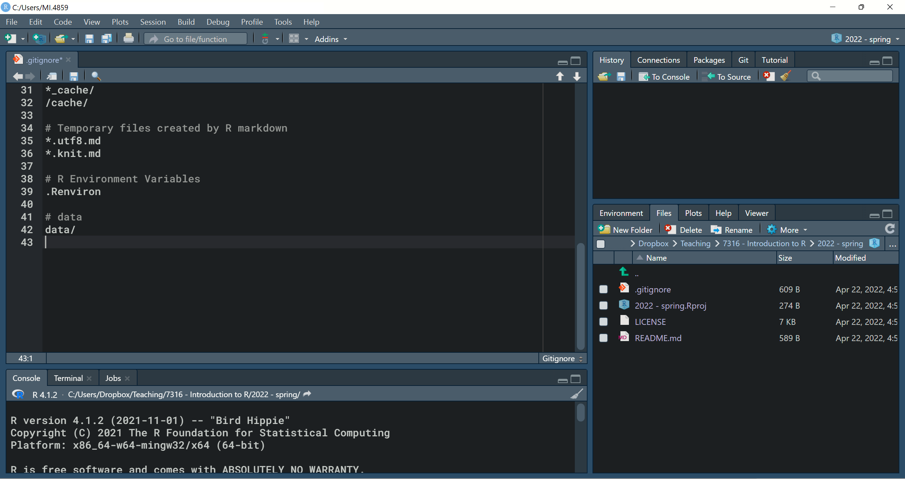
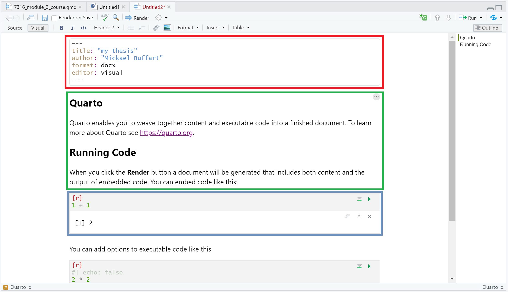

<br>

**This document was generated with R markdown.**

\newpage

In the first module, I introduced projects, and explained that all your scripts should be part of _RStudio projects_. The projects are useful because they define a project root folder and are able to save a RStudio environment that is unique to each project (the `.RData` file). But there is more! Using project, you can not only run your scripts through a sharable working directory, you can also manage the complete workflow of your research projects over time, from data access and cleaning to the generation of documents to share, including your findings. Further, the use of projects allow you an easy **version control**: this is the equivalent of _track change_ in Word documents, with the possibility to share your project with collaborators.


# Using version control with R

## What is version control?

Version control is a way to track changes in files. The most popular software for version control is [Git](https://en.wikipedia.org/wiki/Git). Git was authored by _[Linus Torvalds](https://en.wikipedia.org/wiki/Linus_Torvalds)_ (also the creator of Linux) because he wanted to work collaboratively with other programmers without needing to discuss with them. Of course, this may sound a bit dull, but it was a tremendous success, because it saves a lot of time. For any project using Git: you can track, approve, or revert any change of any users in a smooth and transparent way. Version control allows you to:

* see a history of every change made to files
* annotate changes
* revert files to previous versions
* track user changes on a file

### Git and Github

With Git, you can manage versions of your files on your local computer. Git is usually combined with cloud solution, to track changes on multiple computers, or with multiple users.

One famous cloud solution for Git is [Github](https://github.com/). Github is a commercial cloud service owned by Microsoft. You can easily create a free Github account, with some limitations, but enough resources to manage a personal R project^[Many alternatives, equally compatible with RStudio, exist, such as BitBucket, Gitlab or Amazon Web Service. It is also quite easy to configure your own Git server, if you do not want to use proprietary solutions. Yet Github is certainly the most popular, and the most ready-to-use platform at the moment.].

**Important Note:** Github is a great tool to share and manage R codes with peers, but it is, to my knowledge, **not [GDPR](https://en.wikipedia.org/wiki/General_Data_Protection_Regulation) compliant** (the E.U. regulation regarding data protection). This means that you **CANNOT** store data on Github.

In this course, we will also cover how to use Github without compromising your research data.

### Some vocabulary

* **Repository:** to simplify, the _repository_ is your working directory. With Git, contrary to Word, you do not track changes on only one file, but on the content of a folder (_e.g._ your working directory). This folder is called a repository. With Github, the repository has a _local_ copy (on your computer) and an _online_ copy (on the cloud), just as Dropbox or OneDrive.

* **Clone:** With Github, everything starts with a repository on the cloud. First thing you will need to do is to create a local copy (you cannot really make direct changes on the online copy). This is called: to _clone_ the repository.

* **Commit:** In the Git language, _committing_ means that you want to record a change you made on a file. This is like making a snapshot of the current save of a file. Any committed change can be restored to any previous commit.

* **Push** and **pull**: Once you committed changes on a file, you can _push_ them on github, or _pull_ someone else's commit in your local repository. 

* **Merge:** When multiple members of a team modify the same code without knowing about the other one's changes, it results two version of the file. The version can then be _merged_ into one, or kept in separate _branches_.

* **Branch:** a _branch_ is a different version of the same repository that has not yet been merged with the _main branch_.


## Setting up the tools

### Installing Git for local version control

In this course, we will not cover how to use Git for local version control, nor how to configure Git for use directly through RStudio. The reason is that it requires a bit more configuration efforts than what we want to spend in his course: we therefore privilege a ready-to-use solution that you can use in a few minutes. 

### Setting up Github for remote version control

In general, you use version control to be able to share work and progress with a team, or with a greater audience. One easy way to do it is to use Github. 

GitHub connects an online --- share repository to the local Git repository on your computer, "pushing" and "pulling" changes between the local and remote repositories. This means that the changes made by different members of the team are asynchronous (_i.e._ you do not need to be connected to internet to make local changes, but you will have to push them to the cloud later on). It results that you may, from time to time, manage version conflicts, if multiple users modified the same chunk of code (_i.e._ lines of code) at the same time. Git helps you with that.


To get ready with Github:

1. Join github here: https://github.com/signup 

    a. When asked, it is good practice to use firstnamelastname as username, if available (mine is mickaelbuffart), but it does not really matter. Your username is unique. This is the way to find you on github.

    b. When asked, skip personalization at this point

2. Download and install [Github Desktop](https://desktop.github.com/). You can install Github Desktop on Windows and MacOS.


Github desktop is the easiest client to interact with Github. It is able to track changes in a repository just as Git does it, and it is able to _clone_ repositories, and _push_ and _pull_ _commits_ securely between your local copy and Github. Also, it has an easy interface, where you need **no** command line tool to commit any change.

## Using Github and Github Desktop

### Setting up a new repository

When you start a new project, you need to create a new reporitory on Github. The easiest way is to:

1. Log in your [github account](https://github.com/)

2. Click on **New**


3. Supply GitHub with a repository name (_i.e._ this is the name of your working directory; it cannot contain space or special characters)

4. Choose whether or not the repository should be public (_i.e._ ANYONE can see your repository) or private^[With a free Github account, you cannot share a private repository; if you want to collaborate with other people without making your repository public and without a paid subscription, you can do it by [creating a team](https://docs.github.com/en/organizations/organizing-members-into-teams/creating-a-team). It has many limitations compared to a paid account, but that would likely do the job for a school project with two or three partners.] (_i.e._ only the people you explicitly allow can see your repository).

5. In _Add .gitignore_, choose `R` (if you are creating an R project). 

6. You can also choose to add a license or a readme file^[I strongly advise you to add both, especially if you want to share your work with other people at some point, but you can also edit this later.], as you see fit. 

That's it! You can now clone a local copy of your repository, and start populate it with files.

### Cloning a repository

Now, you need a local copy of your repository, where you will make changes. To **clone** your repository:

1. Open Github Desktop (and log in)

2. Click on **File** > **Clone repository...**

3. There, you can click on a repository you own and clone it, or you can enter the URL of a public repository.
    a. For example, if you want to clone this course to your own computer, click on **URL**, and enter `mickaelbuffart/7316`^[**Note:** If you clone a public repository, you will not be able to push commits in it, unless its owners grant you rights to do so].
    b. In the local path, choose where you want to clone your repository on your computer.


* Now, you can find the local copy of your repository in the local path you chose.

* You can also start copy or editing files in your repository, or **Create a new R project** from within RStudio (as we learnt during the first module). The only change here is that you will create your project _in an existing directory_ (_i.e._ your local repository), and NOT in a new directory. 


### Managing .gitignore

After you created an RStudio project in your local repository, you should see the following files:


**Note** that `.git` and `.R.Rproj.user` are hidden and may not appear on your screen. In any case, you should NEVER modify the content of those folder, or you might loose control of your changes.

* Your repository contains a file named `.gitignore`. This is a text file listing all the files you want to ignore from the version control (this means that the files and folders listed here will **NOT** be committed in the version control, and **NOT** be pushed to Github).

* To make sure your data do not end up somewhere on the internet, it is a good practice to make git ignore your `data/` folder. To add your data folder to `.gitignore`, you can:

    1. Open `.gitignore` in RStudio or with a text editor

    2. add `data/` on a new line at the end of the file

    3. Save

* You can also do that with any other file or folder in your local repository on which you do not want to track changes.



  
### Committing changes in Github Desktop

Once you made a few changes in your repository (like, editing the `.gitignore` file), you can open Github Desktop again, and you will see that your current repository list the files you have change.


* On the down-left corner, after you wrote a description of your changes, you can commit them. All the changes you commit will permanently appear in the history tab.

### Syncing changes with a remote repository

If you are just tracking changes with a local repository, commit is sufficient to manage version control, but if you are using version control with an remote (_i.e._ online) repository, you will need sync your commit and the commits of others with github. For this, you have one button, that I highlighted in red in the screenshot above: **fetch origin**. This button has 3 states:

1. **fetch origin** checks if any changes occured online since the last time you checked.

2. **Push origin**: to push your local commits to Github.

3. **Pull origin**: to pull commits from others (on Github) in your local repository.

After pushing your commit, you can see them on [Github](https://github.com).

### Viewing previous commits

* To view previous versions of the files (along with annotations supplied with the commit message), click on the **History** button.

* From there, you can see not only a _difference_ view of the file changes, but you can also open the document exactly how it was written in a previous commit.

* If you want to revert changes, you *could* explicitly revert the file from the contextual menu (_revert changes in commit_), or simply copy over the file with code from the previous commit.

# RMarkdown documents

## Reproducible R Reports

So far, we have been working purely with basic `.R` script files, which are very similar to Stata `.do` files. But R is a programming language that allows you to do **MUCH** more, including dynamic website (to share your data outputs and data online), or reports (the course you are reading was written within R). 


To do so, R is able to combine R code with a markup language: Markdown. Markdown is a markup language, _i.e._ a language made to describe documents (Latex or html are two other famous markup language). The benefit of Markdown is that it is extremely easy and intuitive: you simply write your text as is, and seldomly complete it with some markup to indicate where are the headers, the text in **bold** or _italic_, the bullet points, the numbered list, etc.


Once you have your nicely structured document, combining R code and Markdown text (this is called... RMarkdown), you will need to _knit_ the chunks of codes and markups into the format that people use for report: pdf, Word document, html page, powerpoints, etc. This is done with a package calle [`knitr`](https://yihui.name/knitr/). 


In the first module, I suggested a book to learn how to write Markdown document. If you haven't read it yet, it is not too late! In this book, you will learn all you need to know about knitr and RMarkdown!


* Xie, Y., Allaire, J. J., & Grolemund, G. (2018). _R markdown: The definitive guide._ Chapman and Hall/CRC. https://bookdown.org/yihui/rmarkdown/


### Project workflow structure

But before getting started with RMarkdown, a few words on project workflow. If you start a big project, you will soon end up with a lot of files and folders. It is a good practice to structure your working directory (_i.e._ your repository) in a consistent way.

Usually, you would have something like this:

- `code/`
    + `data_prep/`
    + `analysis/`
- `data/`
    + `raw_data/`
    + `derived_data/`
- `assets/`
- `results/`
    + `tables/`
    + `figures/`


**A few important points:**

* All your data should be in a data folder in your working directory, **NOT** synced on Github. In this folder, you would differentiate the raw data files, from the files containing your manipulations (new variables, etc.). You should **NEVER** modify your raw data files^[I know this is a common practice among users of Excel, Stata, and others, but this is highly discouraged; you should avoid that.]: if you modify the raw files, you may make a mistake and loose precious data forever.

* a `code/` or `script/` folder should contains all your `.R` and `.Stata`. It doesn't really matter how you organize them, but it is usually good practice to separate data cleaning from data analysis.

* `assets/` would usually contains the images and templates that you use to knit your RMarkdown documents (for example, the template to have the SSE style on the document you are currently reading is store in the `assets/` folder)

* Often, you would also have folders like `docs/`, `results/`, or `outputs/` to store the documents, tables, and figures that you create in your scripts (for example, with `ggplot`, `stargazer`, and so on). Here again, you decide how to structure them, but you would usually do not push them on Github because anyone could recreate them with your RMarkdown and codes (hence, add this folder, however you called it, to `.gitignore`.

* Finally, you would write your RMarkdown files (`.Rmd`) directly in the root of your repository (_i.e._ not in a folder): this is because `knitr` interpret the path to assets from where the `.Rmd` files are located. Hence, if you want to avoid complex file path, it is easier to have them in the root folder.


## Knitr and RMarkdown

`knitr` allows for the creation of documents using *RMarkdown*. You can install it as a package in R.

### Creating an RMarkdown document

* After installing knitr, to create an RMarkdown document, go to 
**File** > **New File** > **R Markdown**.

* A popup shows up to ask enter the document Title and Author, as well as what type of document you want to create.


* **Note** that TeX is required to generate pdf document. Also, generating pdf directly will often require combining Markdown with LaTex. Unless you already know and use LaTeX, this is overly complicated for no reason: I would rather advice to generate Word document, and save them as pdf from Word if you want pdf.

* In most cases, your best choice is likely Word document, or Powerpoint presentation, but you may choose as you see fit. Some options of RMarkdown are only available in specific formats.


### Writing and Code in RMarkdown

Once you chose _Word_, and clicked **OK**, a document appeared, with an example code, as on the figure bellow:



* The lines 1 to 6 (squared in red), are the **YAML metadata**, where you set the properties of your document: title, author, type of output, etc. You may also set multiple types of output here.

* Line 8 to 10 (squared in green) are a **code chunk** (_i.e. a portion of R code). _A code chunk_ starts with ```` ```{r} ```` and ends with ```` ``` ````. The opening of the code chunk `{r}` can be followed by properties on how to interpret it. We will see them later.

* Line 12 to 16 (squared in blue) is simply text, including markdown elements.

* On top, if you press `Knit` (in yellow), a Word document will be generated. You do not need to Knit a document after every change, however. You can just as easily run the code chunks. There are specific specific buttons to run either the current chunk or all of the chunks above a given chunk.

## Rmarkdown basics

Anything not written inside of these bacticked sections is interpret as normal writing. RMarkdown makes styling your writing particularly easy. Some common formatting options include:

* **Headers:** Headers are defined using hashes (`#`). A single # indicates a top level heading. Additional # will indicate second, third, etc. level headings.

* Text in **bold** is wrapped between two asterisks: `**Bold Statement**`

* Text in *italics* is wrapped between one asterisk: `*Italic Statement*`

### Unordered Lists

**Lists and bullet points**: You create a bulleted list by starting each bulleted line with a dash (`-`) or an asterisk (`*`). **Make sure** to leave an empty line between the start of the list and any other text.
  
To make an indent "sub-list", start the sub-list with a plus sign (`+`) and use tab to indent the line twice for each of the sub-list items.


### Ordered Lists  

Ordered lists use the same indent rules as unordered lists, but with numbers and letters instead of stars and plus signs. You can also generally uses automatic numbering by repeating the initial letter or number (e.g.)
    


### Images and URLs

* To include an image, you can point to the file in your assets folder with the following code: ``.

* The code is almost the same for URLs: `[url text](https://www.alinkyouwanttoinclude.com)`

### Seperating Lines in RMarkdown

RMarkdown does not consider single line breaks as the start of a new paragraph: you have to leave a blank line if you want to start a new paragraph.

You may also find many other things you can include in your RMarkdown document (citations, tables, equations, etc.) by reading the _RMarkdown definitive guide_ suggested above.


## Code chunk options

There are several output options you can specify for how R code and the code output are expressed in reports. These options are expressed as options in the `{r}` declaration at the top of the chunk.

* `echo=FALSE`: do not show the R code itself (but potentially the code output depending on other chunk options).

* `include=FALSE`:  do not show the R code or the output in the document.

* `eval=FALSE`: do not actually execute the code inside the chunk, only display it.

* `results="hide"`: run the code but do not show the results output.

* `results="asis"`: this is useful when you are knitting an html output and your code chunk is also generating html content (for example, with `stargazer` outputs)

* `warning=FALSE` / `message=FALSE`: do not show warnings or messages associated with the R code.

* `fig.width=`, `fig.height=`, `dpi=`: in case the chunk contains code to display a plot, these options allows setting the size and resolution of the image in the Word or Html document.

### A note on Stargazer

`stargazer` is a great tool to generate nice regression tables. Unfortunately, if you generate Word document, the output of Stargazer cannot be exported directly. For this, the easiest way to transfer a Stargazer table into Word is:

1. Save the `stargazer` output in an html file (with `type="html"` and `out="filename.html"`; see previous model).

2. Open the html file that you generate into Word (you can do this through the context menu)

3. You can then copy-paste the table in a Word document.

## YAML metadata

The YAML metadata define the general properties of your document, including the appearance and the output format.

To add options to your document, indent the name of the output type to an indented new line and a colon to it. Then indent under the output type and add the desired options.


### Common output options

Here are a few common options:

* To include a **table of contents** in your document, use the `toc: true` option.

* To define the depth of the toc, the option is: `toc_depth: 2` or any other depth you would like.

* To change the way data.frame output is printed, use the `df_print` parameter. Good alternatives are `kable` or `tibble`.

* **For html documents**, you can add syntax highlighting for R chunks, use the `highlight:` parameter. Options include `default`, `tango`, `pygments`, `kate`, `monochrome`, `espresso`, and others This, however, works only for htmlt documents. The syntax highlighting in Word documents is defined through a template file.

* **For html documents** and beamer presentations, you can also specify output themes. Possible themes are listed [here](https://rmarkdown.rstudio.com/html_document_format.html#appearance_and_style) while beamer themes are typically supplied by .sty files in your project folder.

* **For word documents**, if you would like to customize anything, you need to create a word template and save it as a `.docx` file. Then, you can call your template with the option: `reference_docx: "assets/template.docx"`^[To make sure you do not lack any style, the easiest is to create a Word output from the default Rmd document, update the styles as you see fit, and save the results in `template.docx`. The template that I used for this document is available in my repository on Github].


## R Notebooks

Aside from the standard RMarkdown documents that we've covered so far, another format worth mentioning is the **R Notebook** format. R Notebooks essentially adapt html RMarkdown documents to be even more similar to something like Jupyter Notebooks.

* With R Notebooks, you can ***Preview*** documents without knitting them over again. The document also generally has the Notebook-style code-output-code layout.


# To do before the next class

1. Go through this material again and through the RMarkdown definitive guide to learn more about it.

2. Try setting up a new repository for yourself on Github:

    a. clone it on your machine
    b. create a new RStudio project
    c. make some changes; commit and push your change on Github

3. Go back to the case you did in module 4. Try to regenerate the output within a word document (with RMarkdown), including the chunks of code, and explaining what you are doing. Try to present the results nicely.

4. Regenerate the same document in html format. Adjust the required options to present it nicely.

5. Create a PowerPoint presentation (with RMarkdown) containing the graph you made with ggplot in module 4. Have one slide with a title, one slide with the code, one slide with the graph (in high quality), and one slide with a comment, in a bullet list.


