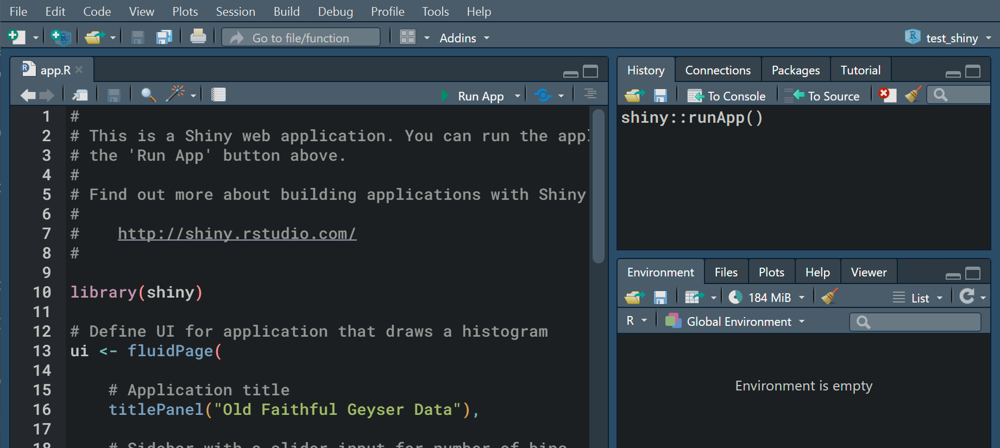

<br>

**This document was generated with R markdown.**


# Creating interactive outputs


In the two previous session, we learnt how to create figures (with `ggplot2`), tables (with _e.g._ `stargazer`) and documents (with `kniter` and RMarkdown). Those, however, are static outputs: this means that your audience cannot interact with those (_e.g._, moving the graph, ordering the table, changing the variables, etc.). In some cases, you may want to give more freedom to your audience, so that they can better understand your results and findings. R offers you multiple tools to allows users interacting with your figures, your tables, or your data.

## Interactive figures with `plotly`

`plotly` is yet another tool to generate graphs, like `ggplot2`, where the generated graphs will not be an image, but a webpage, _i.e._ your audience will be able to perform actions on the graph with the mouse in the webbrowser. Actions includes zooming in the plot, rotating the plot (useful for 3D plots) and selecting observations.

### A simple example

* **Warning:** The figures bellow will not show properly in the pdf, because pdf documents are not interactive. If you want to interact with the figure, you have to run the code in R, or regenerate the document in an html output.


```{r}
df <- rio::import("data/graph_reg.Rds")

# Loading plotly
library(plotly)
```

* Plotting a simple graph

```{r, eval=FALSE}
plot_ly(df,
        x = ~iv,     
        y = ~dv,
        type="scatter")

```

* Adding a third dimensions

```{r, eval=FALSE}
plot_ly(df,
        x = ~iv,     
        y = ~iv_2,
        z = ~dv)

```

* Adding groups

```{r, eval=FALSE}
plot_ly(df,
        x = ~iv,     
        y = ~iv_2,
        z = ~dv,
        color = ~group)

```

* Changing colors of the groups

```{r, eval=FALSE}
plot_ly(df,
        x = ~iv,     
        y = ~iv_2,
        z = ~dv,
        color = ~group,
        colors = c('#BD382B', '#0C5B8F'))

```

* Changing size

```{r, eval=FALSE}
# Create a new variable to add as size
df$random_size <- rnorm(nrow(df), 1, 100)

plot_ly(df,
        x = ~iv,     
        y = ~iv_2,
        z = ~dv,
        color = ~group,
        colors = c('#BD382B', '#0C5B8F'),
        size = ~random_size)

```

### A more complex example: drawing maps

```{r, eval=FALSE}

# Map example, from https://plotly.com/r/mapbox-county-choropleth/

# Get data
url <- 'https://raw.githubusercontent.com/plotly/datasets/master/geojson-counties-fips.json'
url2 <- "https://raw.githubusercontent.com/plotly/datasets/master/fips-unemp-16.csv"

counties <- rjson::fromJSON(file = url)
df <- read.csv(url2, colClasses = c(fips = "character"))

# Create the map
fig_map <- plot_ly() %>% 
  add_trace(
    type = "choroplethmapbox",
    geojson = counties,
    locations = df$fips,
    z = df$unemp
  ) %>% 
  layout(
    mapbox = list(
      style = "carto-positron",
      zoom = 2,
      center = list(lon = -95.71,
                    lat =  37.09))
  )

fig_map

```


* Plotly is not the only alternative for interactive graphs. Especially, for maps, there is a dedicated tool, called [`leaflet`](https://rstudio.github.io/leaflet/), much more handy. An example:

```{r, eval=FALSE}
library(leaflet)

# Load leaflet object
leaflet() %>%
  # openstreetmap tiles
  addTiles() %>%
  # choose what to display
  addMarkers(lng = 18.0548702,
             lat = 59.3421509,
             popup = "Handels")

```

* This was just a very brief introduction about plotly. You can read more about it [here](https://plotly.com/r/): this will cover all the possibility about it, including other type of graphs, designs, and interactions you can have with plotly.


## Interactive outputs with `shiny`

Shiny is a very powerful subset of tools, that allows creating webpages that include buttons, sliders, or text forms. To use shiny, you will have to create a specific shiny project (_i.e._, this is not a normal R project). 

Shiny then contains two elements:

1. A frontend (_i.e._ the webpage), that contains the buttons and the outputs that you want in your interactive page.

2. A backend (_i.e._ a server part), that will analyze the request from the webpage and prepare the requested outputs. The R code that you use to type is in the backend. The frontend is mostly composed of html markup.

### Create a shiny project

* To create a shiny app, go to **File** > **New project...** > **New directory** > **Shiny Application** and give it a name.

* Once you created the new project, a default file called "app.R" appears: this is a shiny app that you can run.



* To run the shiny app, click `Run app`. It will starts a server, and open the app in the webbrowser. 

### The Shiny UI

* The shiny app contains two parts. The first part is a `ui` function (_i.e. User Interface):

```{r, eval=FALSE}
# Define UI for application that draws a histogram
ui <- fluidPage(

    # Application title
    titlePanel("Old Faithful Geyser Data"),

    # Sidebar with a slider input for number of bins 
    sidebarLayout(
        sidebarPanel(
            sliderInput("bins",
                        "Number of bins:",
                        min = 1,
                        max = 50,
                        value = 30)
        ),

        # Show a plot of the generated distribution
        mainPanel(
           plotOutput("distPlot")
        )
    )
)
```

* The function contains the elements that you want to display on the page. The app above contains:

1. A title, created with `titlePanel()`

2. A slider input, created with `sliderInput()`

3. A plot output, created with `plotOutput()`

* The you see that the slider and the plot are respectively placed in a `sidebarPanel()` and a `mainPanel()`. If you run the shiny app, you will see the elements placed on your screen.

* Shiny apps can contains many other elements, but they are always placed on the screen using the same logic: invoking the name of the object with a function.

* The list of objects you can place are available here: https://shiny.rstudio.com/reference/shiny/1.6.0/

### The Shiny Server

* The second important part of a shiny app is the **server**. This is what gets the inputs (such as the `sliderInput()` above) and generate the outputs (such as the `plotOutput()` above).

* The server side is also a function:

```{r, eval=FALSE}
# Define server logic required to draw a histogram
server <- function(input, output) {

    output$distPlot <- renderPlot({
        # Here, you get the data that you want to display:
        #   this could come from a data file.
        x    <- faithful[, 2]
        
        # Here, getting the input from the UI slider, you create
        #   a bin variable
        bins <- seq(min(x), max(x), length.out = input$bins + 1)

        # draw the histogram with the specified number of bins
        #  --> This is the thing your renderPlot function returns
        hist(x, breaks = bins, col = 'darkgray', border = 'white')
    })
}
```

* The function contains two parameters: `input` and `output`. They are the two lists of inputs and outputs define in the UI. For example, in the UI, we created a `sliderInput()` called `"bins"`: it is accessible from the server side, as `input$bins`. In this case, as `bins` is a slider that is set to a value between 1 and 50, `input$bins` is a value between 1 and 50. Every time the slider is moved by the user, the value of `input$bins` is updated. This value can be used in any R code.

* The other parameter is `output`. This one expects element to render on the webpage. For example, the UI contains a plot called `"distPlot"` (see the UI code, above). This means that the server needs to render a plot and save it in the list of outputs, in an object called `distPlot`: then, the UI will be able to access it. This is what we have in the code, with the function `renderPlot({})`, assigned to `output$distPlot`.

* Every time the user interface is updated (for example, the slider is moved), the functions of the servers are run again, and the new plot is rendered.

### Deploy the app

* The app that you have designed is run locally, on your computer. This can be handy during presentations sometimes, but this is not enough to let other people interact with it.

* If you want to share it online, it is possible to deploy it on a webserver. This requires some skills in web deployment. However, you can also find ready-made cloud solution to deploy your app. For example, RStudio allows you to deploy your app (_i.e._ make it accessible throught the webbrowser of other people) on their website, here: https://www.shinyapps.io/

* Shinyapps.io is not free for large scale application, but you can test it and developp personnal project with the free version.


### Read more about `shiny`...

* The shiny developers created a complete course accessible for free, if you would like to learn more about it: https://shiny.rstudio.com/tutorial/


# More about style and elegance

So far, we used short and easy examples. If you plan to continue using R, either for your thesis, or in your job, you will soon end up with more complex dataset, and more complex projects. In this final section, I give you some advice to improve the speed and usability of your code:

## Advice on speed

### Don't use loops!

In R, loops are very, **VERY** inefficient! If you have one million observations, it might take hours to run your loop. This does not work. R is designed to manipulate vectors. As much as you can, manipulate vectors. 

**Example:**

* I create a big data.frame, with 100000 observations. I want a third variable, `var_3`, in `df`, that is the product of `var_1` and `var_2`.

```{r}
df <- data.frame(var_1 = rnorm(100000, 1, 5),
                 var_2 = rnorm(100000, 10, 15))

```

* With a loop:
```{r, eval=FALSE}
df$var_3 <- numeric(length = nrow(df))
starttime <- Sys.time()
for (i in 1:nrow(df)) {
  df$var_3[i] <- df$var_1[i] * df$var_2[i]
}
endtime <- Sys.time()

# Time to run
endtime - starttime
```

* The code above would take about **5 mins** to run.


* Now, with a vector manipulation:
```{r}
starttime <- Sys.time()
df$var_3 <- df$var_1 * df$var_2
endtime <- Sys.time()

# Time to run
endtime - starttime

```

* The code above takes less than a second to run. **Both codes lead to the exact same results!**


**More complex example:**

* You might think, what if I need to check each elements one by one? For example, if I want `var_3` to be the product of `var_1` and `var_2` only if `var_1` is above 5, and equals `var_1` otherwise.

* Solution: proceed by steps, and **use vectors**
```{r}
starttime <- Sys.time()

tmp <- df[df$var_1 >= 5,]
tmp2 <- df[df$var_1 < 5,]

tmp$var_3 <- tmp$var_1 * tmp$var_2
tmp2$var_3 <- tmp2$var_1

df <- rbind(tmp, tmp2)

endtime <- Sys.time()

# Time to run
endtime - starttime

```

* Here, the time to run is, again, less than a second. If you would use a loop, with a if condition, that would likely take 15 minutes to run.


### data.frame are slow!

* Accessing a `data.frame` takes time for R, especially if the `data.frame` contains hundreds of thousands of variables.

* If you have to access a data.frame multiple times for a specific variables (for example, in a loop that you cannot avoid), it is faster to extract the variable from the data.frame, compute it, and then save it back:

* **Example:** This, is faster (and gets even faster compared to the other code bellow if `df` contains many variables):

```{r, eval=FALSE}
var_1 <- df$var_1
for (i in 1:length(var_1)) {
  var_1[i] <- var_1[i] + 2
}
df$var_1 <- var_1

```

* than this:

```{r, eval=FALSE}
for (i in 1:length(var_1)) {
  df$var_1[i] <- df$var_1[i] + 2
}

```

* **Note** that both codes above make no sense: you should use vectors to compute var_1 in both cases.

## Advice on memomry

### Mind you data types!

* If your computer has memory issues, you may want to reduce the size of objects. Not all objects in R are made equal! A `logical` takes much less space than a `character`. For example

```{r}
# A gender variable with 200000 observations
gender <- c(rep("female", 100000), rep("male", 100000))
object.size(gender)

# Now, the same information, as a logical
is_female <- c(gender == "female")
object.size(is_female)
```

* You will note that the `is_female` object (logical) above is twice smaller than the `gender` object (character) although they contain the same information.

* In general:

    + Using `factor` is cheaper in memory than using `characters`
    
    + Using `integer` (if possible) is cheaper than using `numeric`
    
    + `logical` is the cheapest (if possible)


### Clean after you

* If you stored and created many objects in your environment, you may run out of memory. To get free space again, think of deleting the objects and freeing the memory.

* To delete an object

```{r}
rm(tmp)

```

* To collect garbage (= free memory that is not used anymore)

```{r}
gc(reset = TRUE)

```

## Advice on code

### Dummy variable: be affirmative!

* It is often the case, when you see a dummy variable in dataset, that it is coded as 0, 1, with an obscure name (for example, `gender`) and a label indicating the levels (_e.g._ `female` or `male`. This is not ideal, because the variable name does not indicate what is 0 and what is 1.

* what you should use instead is affirmative names. For example, `is_female` is better than `gender` because it tells you that 1 is the `female` level and 0 the other level.


### Use functions!

It is very often that you want to proceed to multiple steps in your analyses. The usual practice is simply to write hundreds of lines of codes in a row. This is a bad practice, because it makes it very difficult to track changes on your variables in the long term.

* If you want to perform any operation, such as, computing `var_3`, create a function for this:

```{r}
compute_var3 <- function(var_1, var_2) {
  # Your code
}

```

* By doing so, you know exactly where is all the code related to the creation of your var_3 variable. You can easily run it independently, and even store it in a different file.


### Separate data manipulation from data analyses!

* In general, when you analyze data, you should store the preparation of the dataset and the analysis in different files. This avoids having multiple version of the same variable, used in different analysis (for example, if you run a linear model with `var_3`, then make changes on `var_3`, then run another linear model, you will not be able to tell that `var_3` changed in the meantime by looking at the output).

* In any data analyses process, you should follow those steps:

1. Load the raw data

2. Process the data with any necessary steps (remove missing, compute new variables, etc.)

3. **Save the complete data manipulation in a new file, in `.Rds` format**

4. When creating the output and analysis, only use the cleaned file, in `.Rds` format, that you created: you should not change anything in your data anymore at this stage, to make sure everything is transparent and reproductible.


# To do after the last seminar

1. Try to create a shiny app that display a scatter plot and a regression output of `graph_reg.Rds` (used multiple time in the course), where the user can choose which iv to include in the graph and model (iv, iv_2, or both). You can be as creative as you like.

2. Do not forget to do and submit the final assignment before May 15th.


